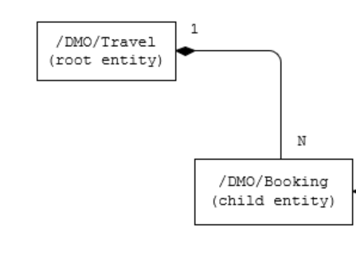
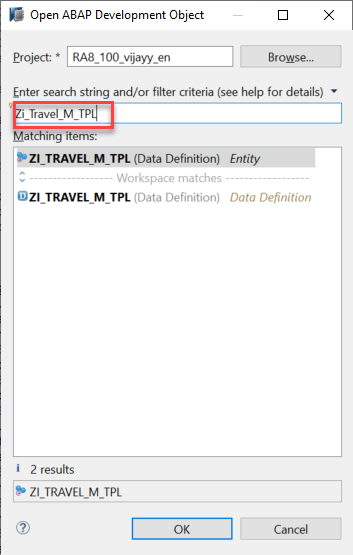
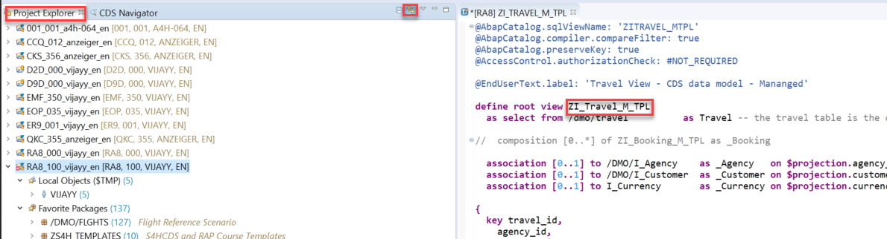
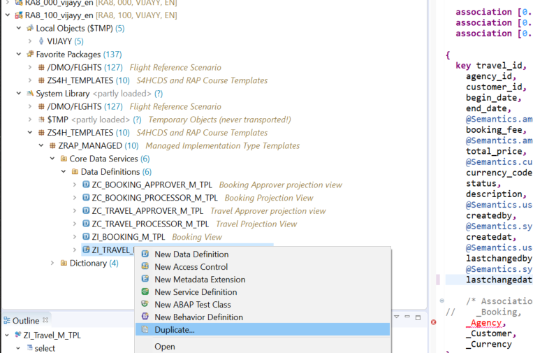
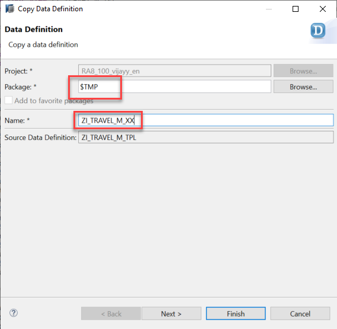

[HOME](https://github.wdf.sap.corp/DevelopmentLearning/restful-abap/wiki)

# Defining the Data Model with CDS 
* [Introduction](#introduction)
* [Exercise 1 - Implementing the Travel and Booking Interface CDS View as a Data Model](#exercise-1)

# Introduction

From a structural point of view, a business object consists of a tree of entities that are linked by compositions. Every entity in this composition tree is an element that is modeled with a CDS entity.
For our demo travel booking scenario, we will implement a 2-level hierarchy composition tree.
As depicted in the figure below, the 2-tier entity hierarchy for managing transactional data in our scenario consists of the following editable entities, with a 1: N cardinality on each level:
* Travel
* Booking

i.e. each travel instance has 0..N bookings
The figure below shows the composition relationship between the travel and the (flight) booking entities, where the travel entity represents the root of the data model.

Travel data of our demo application is distributed across two database tables: a table for the travel header data `/dmo/travel` and a table for flight bookings `/dmo/booking`.

In this module you create CDS views as the basis for the data model of our demo scenario. For each data definition a corresponding development object, the related CDS views and the corresponding database views are created too.

Diagaram pending #TO-DO

To define a data model based on the ABAP CDS view concept, you first need to create a data definition as the relevant ABAP Repository object using a wizard in ABAP Development Tools.

# Exercise 1 - Implementing the Travel and Booking Interface CDS View as a Data Model

1. Duplicate the CDS View **ZI_Travel_M_TPL** to local object. To open the CDS view you can use shortcut `Cltr + Shift + A` and give the CDS view name in search string and click on **OK** button.

2. Make sure **link with editor** is selected in project explorer so that CDS view location can be identified.

3. Right click on CDS view **ZI_Travel_M_TPL** in the project explorer and select **Duplicate**

4.	Wizard opens to copy the data definition give below details and click on Finish

    a.	Travel CDS View Name: `ZI_TRAVEL_M_XX` (Replace XX with your initials)
    
    b.	Package: `$TMP` (local object)

5.	Repeat steps 1 to 5 and Duplicate the CDS View `ZI_Booking_M_TPL` to local object.
6.	Make below changes to CDS view `ZI_BOOKING_M_XX`

    a.	Change SQLView Name: `ZIBOOKING_MXX`
    b.	Save the changes using shortcut `Cltr+S`
    
7.	Make below changes to CDS View `ZI_TRAVEL_M_XX`

    a.	Change SQLView Name: `ZITRAVEL_MXX`
    b.	Save the changes using shortcut `Cltr+S`
    
8.	Click on icon **Activate Inactive ABAP Development Objects (`Ctrl + Shift + F3`)** to activate both Travel and Booking CDS View

9.	Select Travel - `ZI_TRAVEL_M_XX`, Booking - `ZI_BOOKING_M_XX` CDS View and click on Activate button then both CDS view will be activated.

#### Solution 
Solution for this exercise can be found [here](https://github.wdf.sap.corp/DevelopmentLearning/restful-abap/blob/master/DataModelManaged/Solutions/readme.md)

**Next Steps**

[Developing Transactional App Based on Managed Scenario](https://github.wdf.sap.corp/DevelopmentLearning/restful-abap/blob/master/DevelopingTransactionalAppM/README.md)
