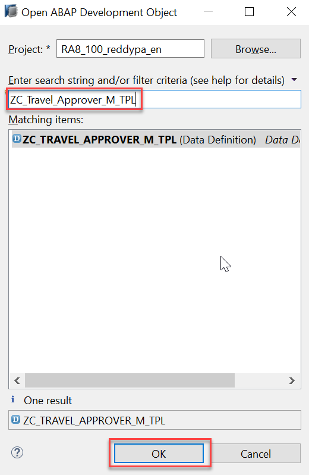
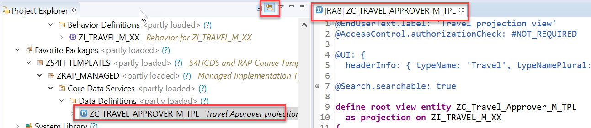
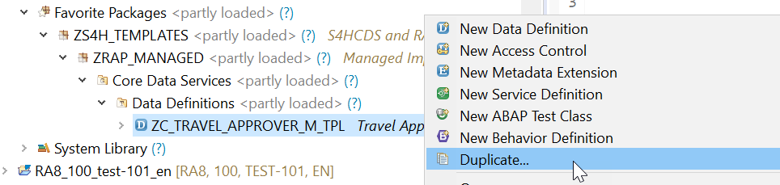
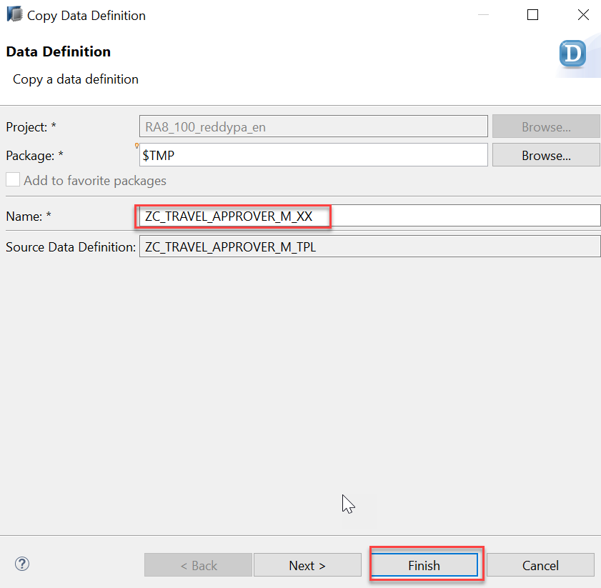
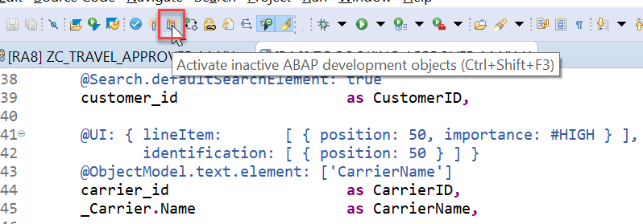
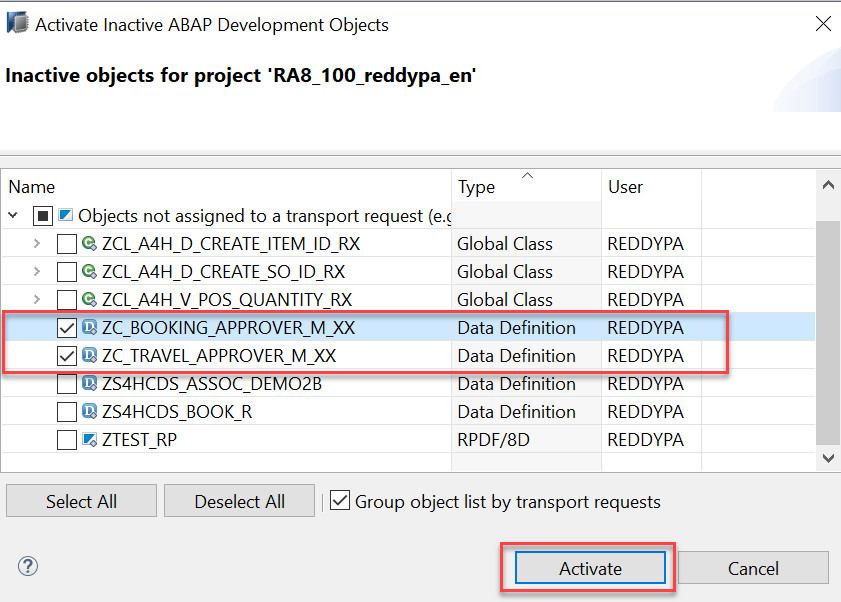
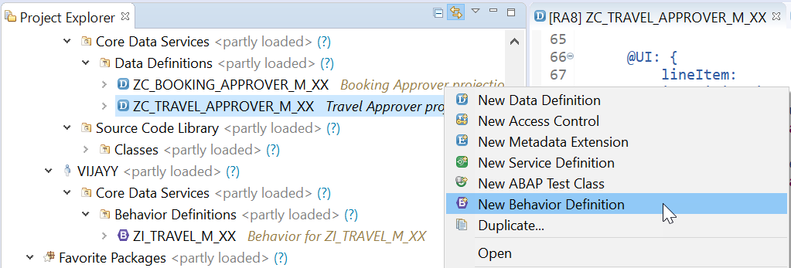
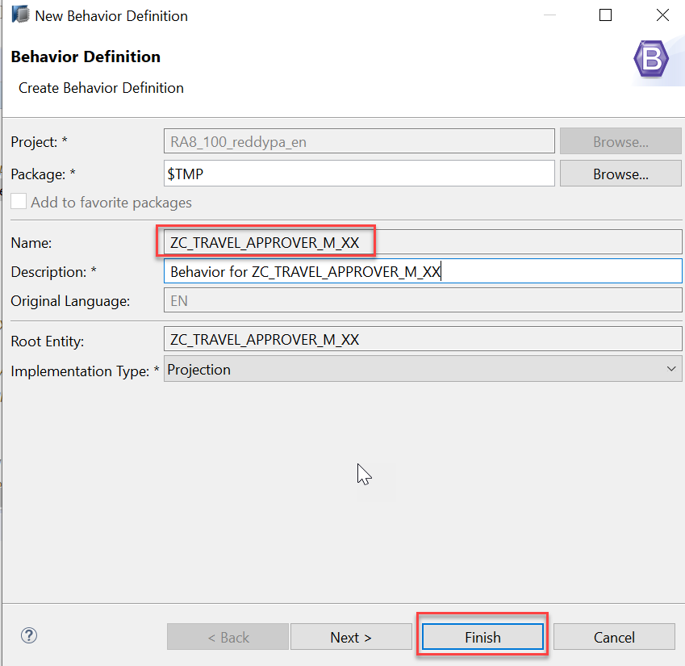

**Previous Step**

[Developing Validations, Actions, Determinations and Feature Control](https://github.wdf.sap.corp/DevelopmentLearning/restful-abap/blob/master/DevelopingValidationsM/README.md)

# Defining Behavior definition for the Travel Approver BO Projection (BDEF Projection)
* [Exercise 1 - Implementing the Travel and Booking Projection CDS View for the Approver BO](#exercise-1)
* [Exercise 2 - Defining Behavior definition for the Travel Approver BO Projection (BDEF Projection)](#exercise-2)

<a id="exercise-1"></a>
# Exercise 1 - Implementing the Travel and Booking Projection CDS View for the Approver BO
1.	Duplicate the CDS View `ZC_Travel_Approver_M_TPL` to local object. To open the CDS view you can use shortcut `Cltr + Shift + A` and give the CDS view name in search string and click on `OK` button.



2.	Make sure `link with editor` is selected in `project explorer` so that CDS view location can be identified. 



3.	Right click on CDS view `ZC_Travel_Approver_M_TPL` in the `project explorer` and select `Duplicate`.



4.	Wizard opens to copy the data definition give below details and click on `Finish`.

    a.	Travel CDS View Name: `ZC_TRAVEL_APPROVER_M_XX` (Replace XX with your initials)
    
    b.	Package: `$TMP` (local object)
   
 
 
 5.	Repeat steps 1 to 5 and Duplicate the CDS View `ZC_BOOKING_APPROVER_M_TPL` to local object.
 6.	Make below changes to CDS view `ZC_BOOKING_APPROVER_M_XX`
 
    a.	Change source CDS View name as `ZI_BOOKING_M_XX` (Replace XX with your initials)
    
```
    …
as projection on ZI_BOOKING_M_XX
….
```

`ZI_BOOKING_M_XX` is the Booking Interface View Created Previously (Module-1 – Exercise -1)

   b.  Uncomment below line in Booking Projection CDS View

```
…
/* Associations */
      _Travel: redirected to parent ZC_Travel_Approver_M_XX,
….
```

   c. Save the changes using shortcut `Cltr+S`, Don’t Active the CDS View.
  
7.	Make below changes to CDS view `ZC_TRAVEL_APPROVER_M_XX`

    a.	Change source CDS View name as `ZI_TRAVEL_M_XX` (Replace XX with your initials)
    
```
…
  as projection on ZI_TRAVEL_M_XX
….
```

`ZI_TRAVEL_M_XX` is the Travel Interface View Created Previously (Module-1 – Exercise -1)

   b. Uncomment below line in Travel Projection CDS View
 
 ```
 …
      		/* Associations */
    _Booking : redirected to composition child ZC_Booking_Approver_M_XX,
….
```

   c. Save the changes using shortcut `Cltr+S`, Don’t Active the CDS View.
    
  8.	Click on icon `Activate Inactive ABAP Development Objects (Ctrl + Shift + F3 )` to activate both Travel and Booking Projection CDS View for Approver BO.
 
 
 
 9.	 Select `ZC_TRAVEL_APPROVER_M_XX (Travel Projection)`, `ZC_BOOKING_APPROVER_M_XX (Booking Projection)`, View and click on Activate button then both CDS view will be activated.
 
  
  
  #### Solution 
Solution for this exercise can be found [here](https://github.wdf.sap.corp/DevelopmentLearning/restful-abap/blob/master/DefiningBehaviordefinitionAM/Solutions/Exercise-1)
  
  
**Explanation**

**Travel Projection CDS View for Approver BO**

Except for the actions, which are different in the processor and the approver projection, the CDS projection views for the processor and the approver BO are identical.
Minor changes can be detected in the field label of the field `TravelID` and `TravelStatus`. This results from the fact, that the approver does not create new travel entries. It is not necessary for this role to know the number range of the `TravelID` or the possible values of the `TravelStatus`. In addition, the approver BO projection has gained a selection field for the `TravelStatus` to make it easier for the approver to filter for open/accepted/rejected travels.

**Actions**

The position and the label for the action button must be defined in the CDS projection views. In the case of an approver, the available actions concerning the travel entity set are `Accept Travel` and `Reject Travel`. The implementation of these actions is done in the behavior implementation . It is simply the UI appearance that needs to be configured in the projection view. The action buttons for the respective actions are designed to appear on the travel list report page and on the travel object page. That is why the annotations are used in the list item and identification UI annotation. When executing the action on the list report page, a travel instance must be selected to assign an instance for the instance-bound action. On the object page, the instance for which the action shall be executed is clear. 

**Booking Projection CDS View for Approver BO**

The CDS projection views for the processor and the approver BO are almost identical.

Value helps are not necessary for the interpretation of the approver role in this scenario. As the booking entity is a read-only entity in this scenario and selection fields with value helps cannot be defined for a sub entity, value helps cannot be applied and thus are not necessary to be defined for the booking entity.


<a id="exercise-2"></a>
# Exercise 2 - Defining Behavior definition for the Travel Approver BO Projection (BDEF Projection)

The scope of the UI service for the `approver` is more limited than for the `processor`. The approver can only modify the travel entity with accepting or rejecting the travel entries. The values in the corresponding booking entries are the basis for this decision-making.

The behavior for the BO projection is defined in a behavior definition of type `projection`. The type is defined in the behavior definition header. The projection behavior definition provides the behavior for the projection CDS view. All characteristics and operations that you want to include in the BO projection must be listed explicitly. The keyword for this is `use`.

**Syntax: Behavior Definition for Projection**

```
projection; 

 define behavior for ProjectionView alias ProjectionViewAlias 
  /* use the same eTag defined in underlying behavior definititon */
  use etag 
 {
  /* define static field control */ 
  field ( readonly ) ProjViewElem1;
  field ( mandatory ) ProjViewElem2;

  /* expose standard operations defined in underlying behavior definition */
  use create; 
  use update;
  use delete;

  /* expose actions or functions defined in underlying behavior definition */
  use action|function ActionName [as ProjAction] [external ExtProjname];

  /* expose create_by_association for child entities defined in underlying behavior definition */
  use association _Assoc { create; }
} 
```

1.	To create a projection behavior definition is to use the context menu in the project explorer by selecting the relevant projection root view `ZC_TRAVEL_APPROVER_M_XX` and choosing `New Behavior Definition`.

  
  
2.	Wizard for Create behavior definition opens, the behavior definition always uses the same name as the corresponding root view.  click on `Finish` button.

  
  
  3.	When creating the behavior definition based on the projection view, the template automatically creates the type projection and lists all available characteristics and operations of the underlying behavior definition. That means, if nothing is done explicitly the BO projection has the same behavior as the underlying BO.
  
For the approver projection, only the following elements are used make changes as below:

```
projection;

define behavior for ZC_TRAVEL_APPROVER_M_XX alias Approver
{

  use update;

  use action acceptTravel;
  use action rejectTravel;

}
```

4.	Click the activation button or use the shortcut `Ctrl + F3` to activate the behavior definition.

  #### Solution 
Solution for this exercise can be found [here](https://github.wdf.sap.corp/DevelopmentLearning/restful-abap/blob/master/DefiningBehaviordefinitionAM/Solutions/Exercise-2)


**Explanation**

Only the characteristics and operations that are relevant for the approver are used in the projection behavior definition. This is only a subset of the behavior that was defined in the underlying BO.

The static field control that was defined for the underlying BO cannot be modified. However, new controls are added to correspond the approver role. The fields that are mandatory for the processor are set to read-only for the approver. In the approver application, one can only change the fields `OverallStatus, AgencyID, BookingFee and Description`.

The `update` operation is enabled for the approver as a modification on the travel entries must be available.

The actions `accept` and `reject` are enabled to change the status of the travel entry.

There is no behavior defined for the booking entity. All fields are read-only in this case.

**Next Steps**

[Defining Business Services Based on Approver Projections](https://github.wdf.sap.corp/DevelopmentLearning/restful-abap/blob/master/DefiningBusinessServicesAM/README.md)


 
  

  


 
 
 


