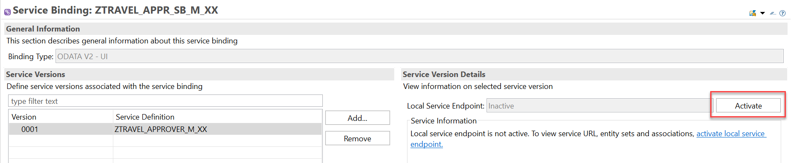
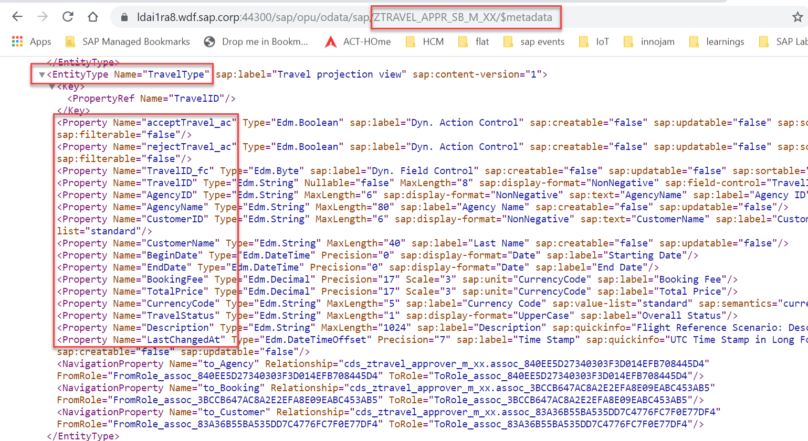

**Previous Step**

[Defining Behavior definition for the Travel Approver BO Projection (BDEF Projection)](/docs/Managed%20Implementation/DefiningBehaviordefinitionAM/README.md)

# Defining Business Services Based on Approver Projections
* [Introduction](#introduction)
* [Exercise 1 - Creating a Service Definition for Approver BO](#exercise-1)
* [Exercise 2 - Creating a Service Binding for Approver BO](#exercise-2)

<a id="introduction"></a>
# Introduction

`Business service` artifacts enable the publishing of an OData service using ABAP Development Tools. In module 1 you defined the data model in this module you use the data model and expose it for an OData service. The OData service makes it possible for UI technologies to query data and consume it. Additionally, there is also the option of creating an OData service for an A2X consumer.

This step is to build a business service for approver projection in order to consume the business object. 

<a id="exercise-1"></a>
# Exercise 1 - Creating a Service Definition for Approver BO

The `service definition` is a projection of the models and related behavior that you want to expose. 

In a service definition, you define the `OData service` to determine which CDS entities are part of the service. This service is then bound to a protocol and to either a `UI` technology or an `A2X` service by a service binding artifact. A service definition can be integrated in various protocols without any reimplementation.

1.	Open the context menu and choose `New->Other ABAP Repository Object->Business Services->Service Definition` to launch the creation wizard.


Click on `Next`.

2.	Give Service Definition Name `ZTRAVEL_Approver_M_XX` and Description as Below and click on `Finish`.


3.	In the service definition editor define the CDS entities which needs to be exposed as `OData service` as below:

```
  expose ZC_TRAVEL_APPROVER_M_XX as Travel;
  expose ZC_BOOKING_APPROVER_M_XX as Booking;
  expose /DMO/I_Customer as Passenger;
  expose /DMO/I_Agency as TravelAgency;
  expose I_Currency as Currency; 
```

Service definition is used to assign the scope of the OData service. `Travel, Booking, Passenger, TravelAgency, Currency` CDS views are exposed in the service definition. Optionally, you can assign an alias for the each exposed CDS view

4.	Click the activation button or use the shortcut `Ctrl + F3` to activate the data definition.

#### Solution 
Solution for this exercise can be found [here](/docs/Managed%20Implementation/DefiningBusinessServicesAM/Solutions/Exercise-1)

<a id="exercise-2"></a>
# Exercise 2 - Creating a Service Binding for Approver BO

A `service binding` implements the protocol that is used for the `OData service`. It uses a `service definition` that projects the data models and their related behaviors to the service.

1.	Open the context menu by right clicking in `Project Explorer` and choose `New->Other ABAP Repository Object->Business Services->Service Binding` to launch the creation wizard for a service binding.


2.	Give Name of Service Binding, Description, Select Binding Type as `ODATA V2(UI)` from dropdown and browse service definition `ZTRAVEL_APPROVER_M_XX` created in [Exercise-1](#exercise-1) as below and click on `Finish`. 


3.	As soon as you have specified the binding for the service, it is ready for publishing. The service is then available for consumption. The binding type and category are already defined and cannot be changed once the service binding is created. To make the service ready for consumption, use the `activate` button in the service binding form editor



After click on button `activate` the button is changed to `Deactivate`.

4.	On the left side of the form editor, the service list with the `service definition` and `version`. The right side of the form editor shows the `service URL` and lists the entity sets that are exposed for the service.


5.	In the previous steps we defined an OData service and published it. It is now ready for to be consumed by an HTTP protocol. To verify the data that the OData service exposes, the service offers a metadata document in which all relevant service elements are listed. Click the `Service URL` in the service binding form editor to check the metadata document of the published OData service. An internal browser opens displaying the `metadata` of the service.



6.	The published OData service is ready to be consumed by an HTTP protocol. You can set up a Fiori application based on this service. The service binding artifact offers a tool which you can use to `preview` a simple list reporting Fiori application. Click the `preview` button by selecting the Entity type or double click the entity in the service binding to check how the `UI` of a Fiori application looks like.


7.	Your internet browser opens a new tab and requests authorization for the system. Enter your user name and password for the relevant system if requested. You now have access to the system and the application is displayed. It does not display any data. Choose `Go` to display the data.


8.	The following UI is achieved by implementing the corresponding features in the CDS Travel projection view for the approver using which you can `approve` or `reject` the travel.


9.	Select accepted status lineitem in the table as below then `Accept Travel` button will be disabled since you implemented dynamic feature control action in Module 5 - Exercise 5. 


Same behavior works with `Reject Travel` as well.


#### Next Step

[Custom CDS Entity](/docs/Managed%20Implementation/CustomCDSEntity/readme.md)
