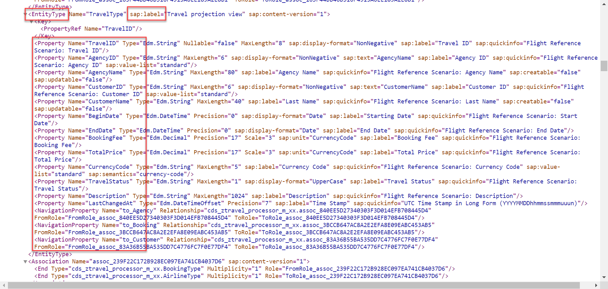
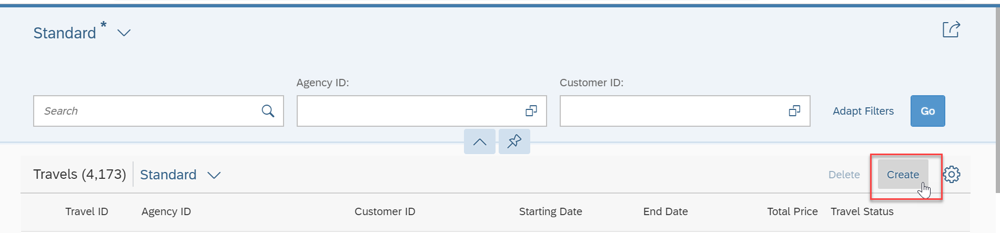
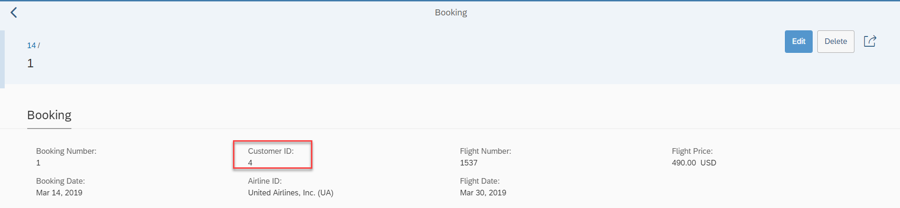

**Previous Step**

[Developing a Projection Layer for Flexible Service Consumption](/docs/Managed%20Implementation/DevelopingProjectionLayer/README.md)

# Defining Business Services Based on Processor Projections
* [Exercise 1 - Creating a Service Definition for Processor BO](#exercise-1)
* [Exercise 2 - Creating a Service Binding for Processor BO](#exercise-2)

<a id="exercise-1"></a>
# Exercise 1 - Creating a Service Definition for Processor BO
The service definition is a projection of the models and related behavior that you want to expose. In a service definition, you define the OData service to determine which CDS entities are part of the service. This service is then bound to a protocol and to either a UI technology or an A2X service by a service binding artifact. A service definition can be integrated in various protocols without any reimplementation.

1.	Open the context menu and choose `New->Other ABAP Repository Object->Business Services->Service Definition` to launch the creation wizard.


Click on next

2.	Give Service Definition Name `ZTRAVEL_Processor_M_XX` and Description as Below and click on Finish


3.	In the service definition editor define the CDS entities which needs to be exposed as OData service as below:

```
  expose ZC_TRAVEL_PROCESSOR_M_XX as Travel;
  expose ZC_BOOKING_PROCESSOR_M_XX as Booking;
  expose /DMO/I_Customer as Passenger;
  expose /DMO/I_Agency as TravelAgency;
  expose /DMO/I_Carrier as Airline;
  expose /DMO/I_Connection as FlightConnection;
  expose /DMO/I_Flight as Flight;
  expose I_Currency as Currency;
  expose I_Country as Country;
 ```
Service definition is used to assign the scope of the OData service. `Travel, Booking, Passenger, TravelAgency, Airline, FLightConnection, Flight, Currency and Country` CDS views are exposed in the service definition. Optionally, you can assign an alias for the each exposed CDS view.

4.	Click the activation button or use the shortcut `Ctrl + F3` to activate the data definition.

#### Solution 
Solution for this exercise can be found [here](/docs/Managed%20Implementation/DefiningBusinessServicesM/Solutions/Exercise-1)

<a id="exercise-2"></a>
# Exercise 2 - Creating a Service Binding for Processor BO
A service binding implements the protocol that is used for the OData service. It uses a service definition that projects the data models and their related behaviors to the service.

1.	Open the context menu by right clicking in Project Explorer and choose `New->Other ABAP Repository Object->Business Services->Service Binding` to launch the creation wizard for a service binding


2.Give Name of Service Binding(`ZTRAVEL_PROC_SB_M_XX`), Description, Select Binding Type as ODATA V2(UI) from dropdown  as below and browse service definition `ZTRAVEL_Processor_M_XX` created in [Exercise-1](#exercise-1) as below and click on Finish. 


3.As soon as you have specified the binding for the service, it is ready for publishing. The service is then available for consumption. The binding type and category are already defined and cannot be changed once the service binding is created. To make the service ready for consumption, use the `Activate` button in the service binding form editor


After click on button activate the button is changed to Deactivate

4.	On the left side of the form editor, the service lists the service definition and version. The right side of the form editor shows the service URL and lists the entity sets that are exposed for the service.


5.	In the previous steps we defined an OData service and published it. It is now ready for to be consumed by an HTTP protocol. To verify the data that the OData service exposes, the service offers a metadata document in which all relevant service elements are listed. Click the Service URL in the service binding form editor to check the metadata document of the published OData service. An internal browser opens displaying the metadata of the service.



6.	The published OData service is ready to be consumed by an HTTP protocol. You can set up a Fiori application based on this service. The service binding artifact offers a tool which you can use to preview a simple list reporting Fiori application. Click the `Preview` button by selecting the Entity type or double click the entity in the service binding to check how the UI of a Fiori application looks like.


7.	Your internet browser opens a new tab and requests authorization for the system. Enter your user name and password for the relevant system if requested. You now have access to the system and the application is displayed. It does not display any data. Choose `Go` to display the data.


8.	To create a new travel, the end user must click the `Create` Button and edit all required fields in the related object page to specify the required information for a new travel instance.




9.	As soon as the user clicks the `Save` button on the object page, the data is persisted in the corresponding database table and a travel instance with a new travel ID is created

.

10.	Click on travel `9999` to navigate object page.


11.	In change mode, the end user can change the relevant travel fields as shown in the figure below.


12.	Edit fields as below and click on `Save` button.


13.	To create booking (child Entity) for Travel `9999` click on `Create` button in the object page in the booking section as shown below and edit all required fields in the related object page to specify the required information for a new booking instance.


On Save if you get error as below then maintain in behavior definition of booking `field ( readonly ) travel_id;` then `travel_id` will be passed automatically by framework during the creation of booking.


Open Behavior definition `ZI_TRAVEL_M_XX` and maintain readonly feature to trave_id and activate the definition. 

```

define behavior for ZI_BOOKING_M_XX //alias <alias_name>
persistent table /dmo/booking
lock dependent( travel_id = travel_id)
//authorization dependent( <local_field_name> = <target_field_name> )
//etag <field_name>
{
....
field ( readonly ) travel_id;
....
}

```


After maintaining refersh the UI and now if you try to create booking then booking entity gets created without any error.


14.	Retrieve travel data which you want to delete, select the radio button of the item and click on `Delete` button.


15.	To update Booking entity retrieve booking data which you want to update, the end user is able to change the relevant booking fields as shown below.




16.	Retrieve Booking data which you want to delete, select the radio button of the item and click on `Delete` button.


**Next Steps**

[Developing Validations, Actions, Determinations and Feature Control](/docs/Managed%20Implementation/DevelopingValidationsM/README.md)


