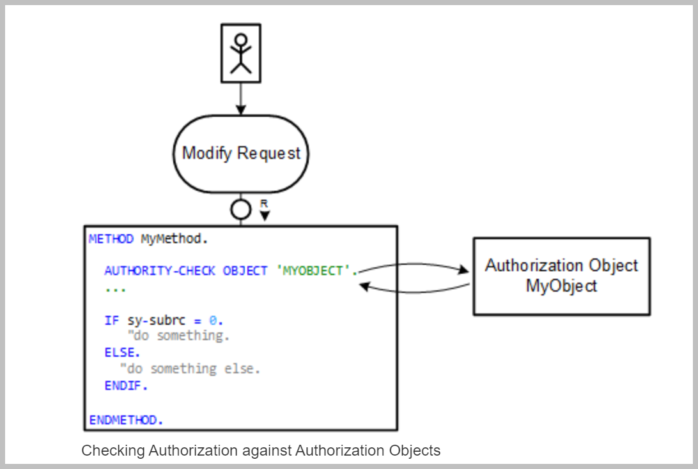
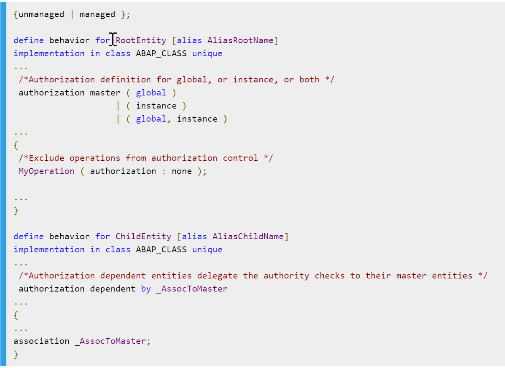
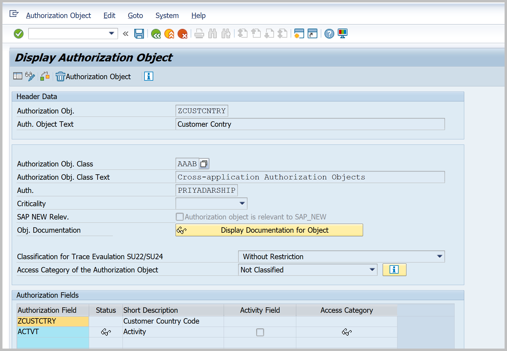
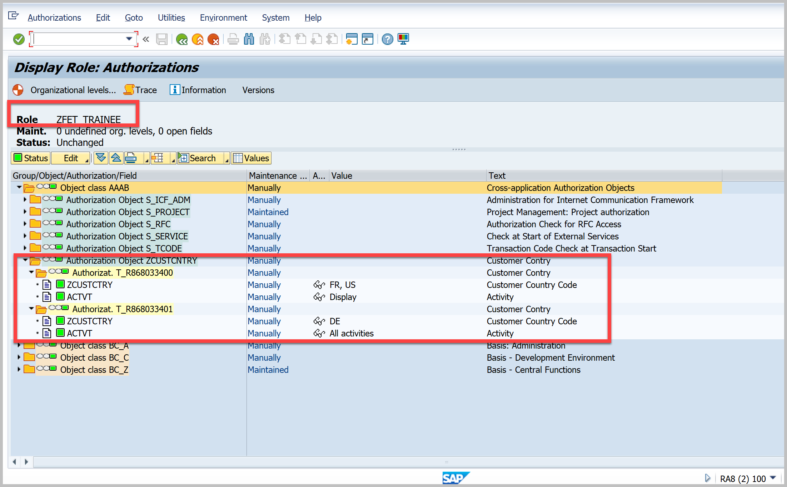
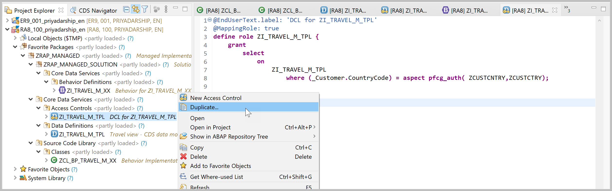
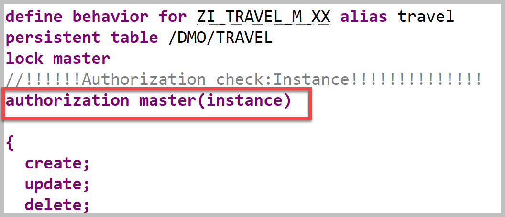
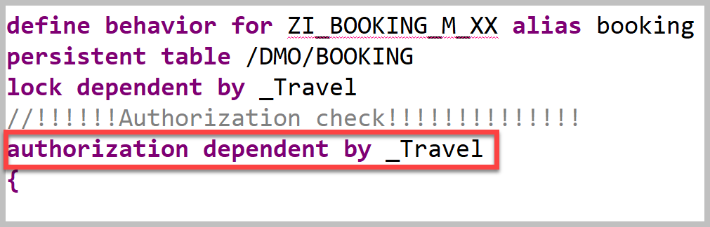
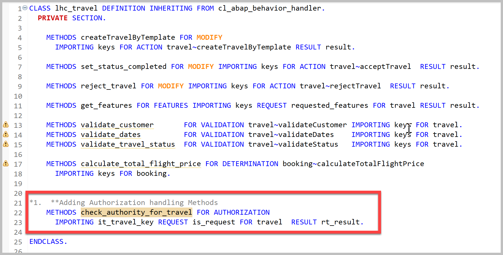
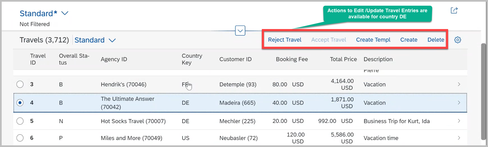
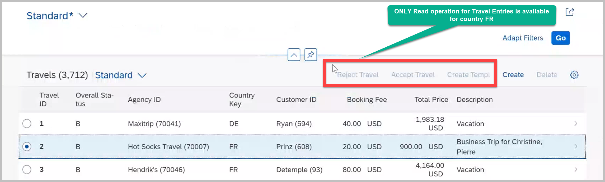

**Previous Step**

[Developing Validations, Actions, Determinations and Feature Control](/docs/Managed%20Implementation/DevelopingValidationsM/README.md)

# Authorization Control 
* [Introduction](#introduction)
* [Exercise 1 - Implementing Authorization Control on Travel and Booking App](#exercise-1)

<a id="#introduction"></a>
# Introduction

Authorization control in RAP protects your business object against unauthorized access to data.
Authorization control is always relevant when the permission to execute an operation depends on the role of the business object consumer.
In RAP each read or modify request can be checked via authorization objects against user roles before the request is finally executed and reaches data. 

•	The authorization check with authorization objects is called from CDS entities in case of read requests.<br/>
•	And from the behavior implementation in case of modify requests.

Authorization Checks for Modify Operations:-<br/>
•	In RAP business objects, modifying operations, such as standard operations and actions can be checked against unauthorized access during runtime. <br/>
•	Authorization objects return authorization values, which you can use in the implementation to further process the request, in case of positive authorization results, or, to reject the modification request, in case of negative authorization results.



# Global Authorization
•	Global authorization is used for all authorization checks that only depend on the user. <br/>
•	Global authorization checks can be implemented for both, static and instance-bound operations.

# Instance Authorization
 
•	Instance authorization is used for all authorization checks that, in addition to the user role, depend on the state of the entity instance in question.Instance authorization is only possible for instance-based operations. <br/>
•	Operations that are excluded from instance authorization are CREATE and static actions. 

# Authorization Definition
•	Authorization is defined in the behavior definition of a RAP business object.<br/>



# Authorization Master
•	An entity is defined as authorization master if the operations of this entity have their own authorization implementation. For the authorization master, you must define either global, or instance, or both.<br/>
•	The current version of the RAP model only supports authorization masters on root entities.<br/>
# Authorization Dependent
•	An entity is defined as authorization dependent if the authorization control from the authorization master entity shall also be applied for the operations of this entity.

<a id="exercise-1"></a>
# Exercise 1 - Implementing Instance based Authorization Control
1. In RA8/100 system PFCG role `ZFET_TRAINEE` exists.It uses an Authorization Object-`ZCUSTCNTRY` which handles activities based on Customer Country Code.
In the role the check is on country France,US and Germany. User with this role will be able to read travel entries from country France and US. However can edit Travel entries from German Country.Here All checks would be done for an Approver.

Authorization Object-`ZCUSTCNTRY`


PFCG role `ZFET_TRAINEE`



2.Duplicate the DCL View **ZI_Travel_M_TPL** to local object **ZI_Travel_M_XX**(Replace XX with your initials). To open the DCL view you can use shortcut `Cltr + Shift + A` and give the DCL view name in search string and click on **OK** button.Make sure **link with editor** is selected in project explorer so that DCL view location can be identified.



3. Enhance the projection view **ZC_TRAVEL_APPROVER_M_XX ** by adding the below column for Country code.
```
@UI: {
          lineItem:       [ { position: 22, importance: #HIGH } ],
          identification: [ { position: 22 } ] }
      @Search.defaultSearchElement: true  
      _Customer.CountryCode as CountryCode,

```
4.	Change the Authorization check in the view `ZI_TRAVEL_M_XX`  from `#NOT_REQUIRED` to `#CHECK`

```
@AccessControl.authorizationCheck: #CHECK

```
5.In the Behavior defination Class `ZI_TRAVEL_M_XX` (Replace XX with your initials),add the below code to enable Authorization Control.


    
6.Add new method in Behavior Implementation Class to handle the Authorization Behavior.



```
 **Adding Authorization handling Methods
    METHODS check_authority_for_travel FOR AUTHORIZATION
      IMPORTING it_travel_key REQUEST is_request FOR travel  RESULT rt_result.

```    
7.	Add below code in the method to handle Authorization
 ```
 *******************************************************************************
*
* Implements what operations and actions are (not) allowed for travel instances
*
*******************************************************************************
  METHOD check_authority_for_travel.

    DATA ls_result LIKE LINE OF rt_result.

    READ ENTITIES OF zi_travel_m_xx IN LOCAL MODE
     ENTITY travel
      FIELDS ( travel_id customer_id status CountryCode )
        WITH VALUE #( FOR keyval IN it_travel_key ( %tky = keyval-%tky ) )
      RESULT DATA(lt_travel)
      FAILED DATA(ls_read_failed).

    LOOP AT lt_travel INTO DATA(ls_travel).

*" Authorization check for countries with Create/Update authorization
      AUTHORITY-CHECK OBJECT 'ZCUSTCNTRY'
        ID 'ZCUSTCTRY' FIELD ls_travel-CountryCode
        ID 'ACTVT' FIELD '01' .

      IF sy-subrc = 0.
        DATA(lv_authorized) = abap_true.
      ELSE.
        lv_authorized = abap_false.
      ENDIF.

*" For US/FR Country User do not have edit authorizations
      ls_result = VALUE #( travel_id   = ls_travel-travel_id
                           %update
                           = COND #( WHEN lv_authorized EQ abap_false
                                      THEN if_abap_behv=>auth-unauthorized ELSE if_abap_behv=>auth-allowed  )
                           %delete
                           = COND #( WHEN lv_authorized EQ abap_false
                                      THEN if_abap_behv=>auth-unauthorized ELSE if_abap_behv=>auth-allowed  )
                            %action-rejectTravel
                            = COND #( WHEN lv_authorized EQ abap_false
                                      THEN if_abap_behv=>auth-unauthorized ELSE if_abap_behv=>auth-allowed  )
                            %action-acceptTravel
                            = COND #( WHEN lv_authorized EQ abap_false
                                      THEN if_abap_behv=>auth-unauthorized ELSE if_abap_behv=>auth-allowed  )
                           %action-createTravelByTemplate
                            = COND #( WHEN lv_authorized EQ abap_false
                                      THEN if_abap_behv=>auth-unauthorized ELSE if_abap_behv=>auth-allowed  ) ).

      APPEND ls_result TO rt_result.
    ENDLOOP.

  ENDMETHOD.
 ```
 8.	Expected Output:-User with the role `ZFET_TRAINEE` would now be able to Edit Entries for country DE and would only be able to Read Travel entries from FR/US country.
 
 DE country:- Approver can now Edit/Update Travel Entries from DE country
  
 
 FR country:- Approver can now only view Travel Entries from FR country
 
 
#### Solution 
Solution for this exercise can be found [here](/docs/Managed%20Implementation/DevelopingAuthorizationControlM/solutions/Exercise-1)

#### Next Step
[Enabling the Draft Handling for semantic key based scenario](/docs/Managed%20Implementation/DraftSemanticKey/README.md)
