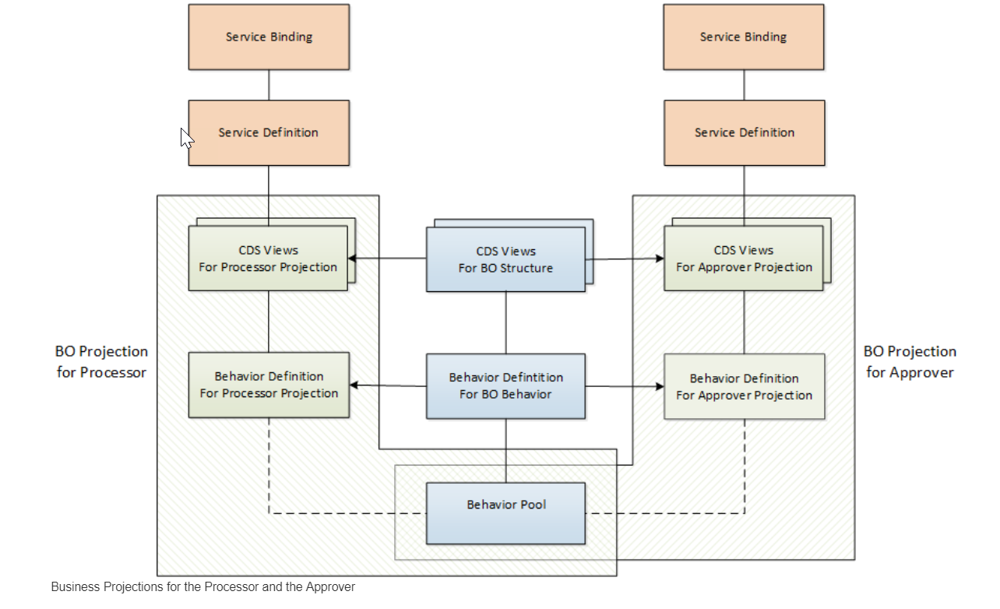
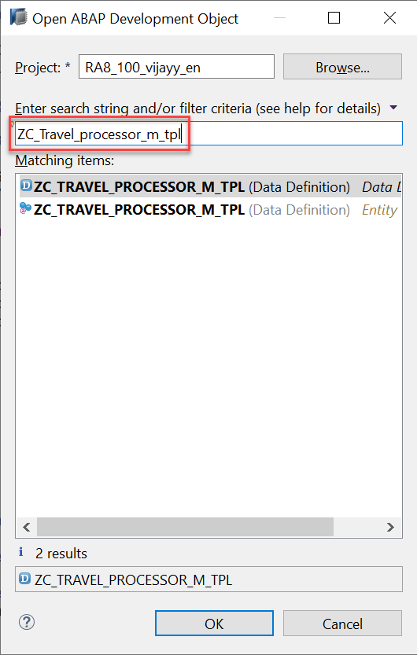
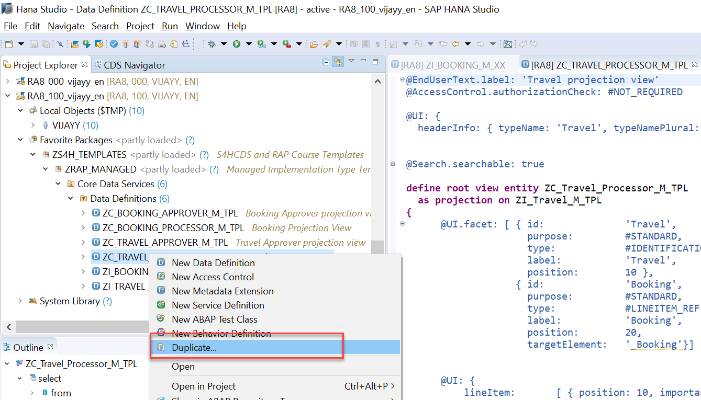
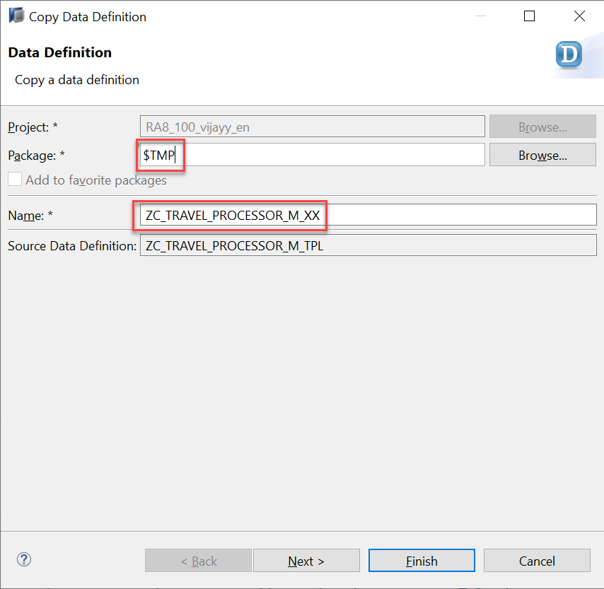
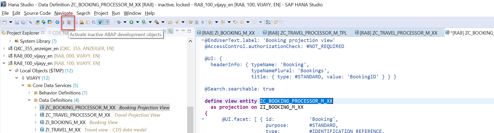
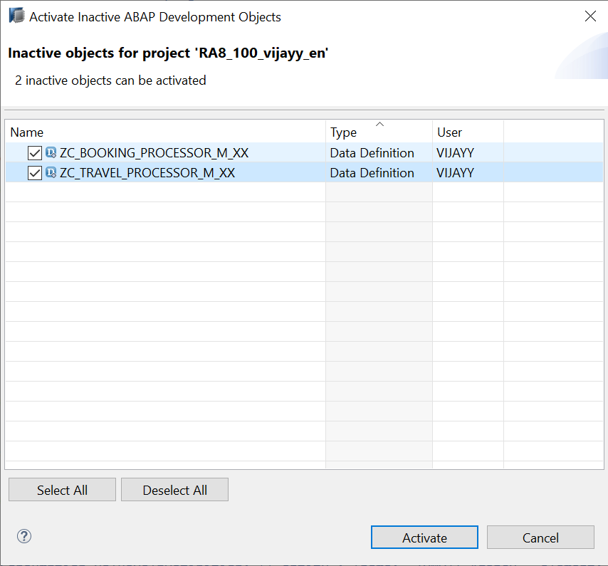
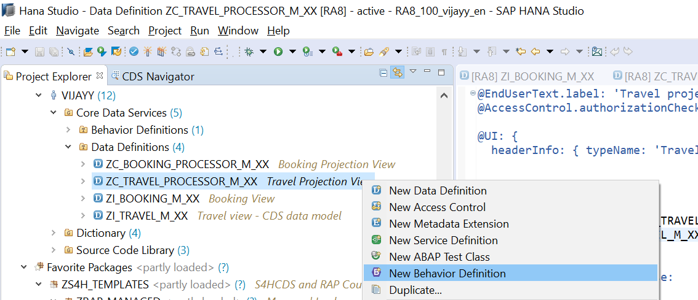
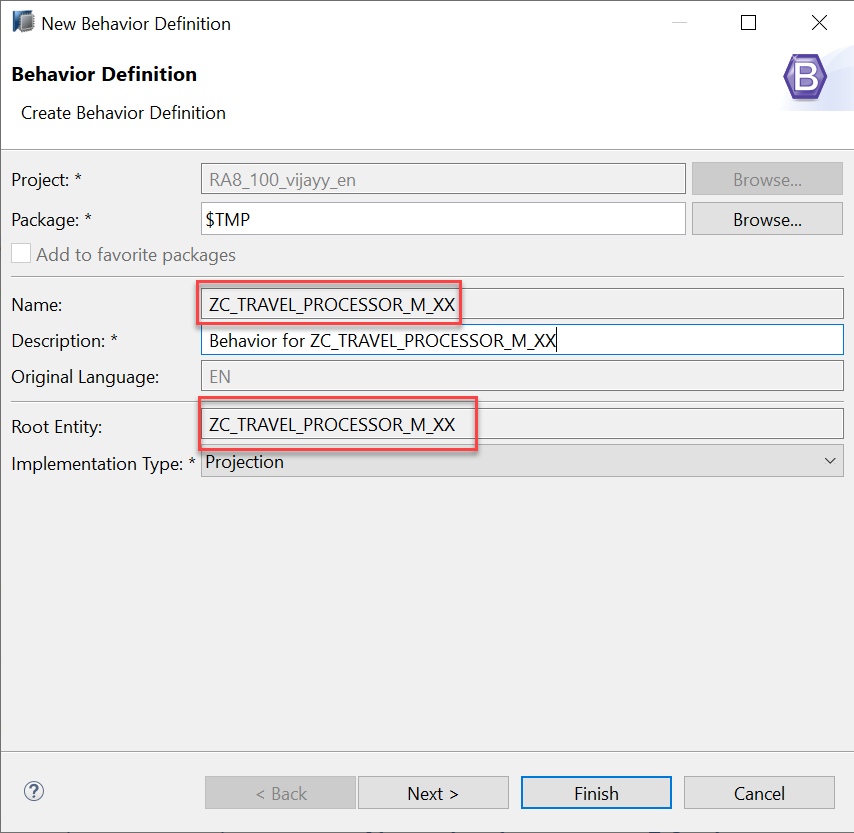

**Previous Step**

[Developing Transactional App Based on Managed Scenario](/docs/Managed%20Implementation/DevelopingTransactionalAppM/README.md)

# Developing a Projection Layer for Flexible Service Consumption

* [Introduction](#introduction)
* [Exercise 1 - Implementing the Travel and Booking Projection CDS View for the Processor BO](#exercise-1)
* [Exercise 2 - Defining Behavior definition for the Travel Processor BO Projection (BDEF Projection)](#exercise-2)

<a id="introduction"></a>
# Introduction

For a more flexible service consumption, every transactional business object is projected into a service specific context. In other words, only those elements of the data model and those behavior characteristics and operations that are needed in the relevant business service context are exposed for the service.

By means of projections, you can expose one BO in different business contexts by using different BO subsets. The general business logic is defined in the BO whereas the BO projection adopts a subset of the business logic.

A layering with projections enables robust application programming. You can change or enhance the BO without changing the exposed service as the scope of the service is defined in the projection layer. Enhancing the business object with additional structure or behavior does not have any effect on the resulting service.

This demo scenario uses two projections with a different service scope. The resulting apps represent two role-based approaches to managing travels.

• One business object projection uses the BO characteristics and the operations that are relevant for processing travel data. This resulting UI service serves the role of a data processor. The responsible person can enter the information about travels, bookings into the role-based app for processing travel data. This person needs functionality to create, update and delete entries on all three tiers of the business object. In addition, the action CreateByTravelTemplate is designed to facilitate the creation of new travel entries. The instance-bound action reads the values of the selected entry and creates a new entry based on these values with some deviations for the TravelID and the travel dates.

• The other business object projection is the basis for a UI service that contains the functionality that is relevant for an approver. Imagine a person, maybe a manager of a travel agency, that approves the data that was entered by the processor. That means, this person sees the travel information and the corresponding booking data. Based on this data, the approver can either accept or reject the travel. For a minimal scope of fields in the travel entity the approver is enabled to edit the values, for example the BookingFee or the Description. The information about bookings is set to read-only for the approver. The approver is not allowed to change the fields of the booking entity.

The design time artifacts that you need for these projection scenarios are illustrated in the following figure.



The CDS views, as well as the behavior definition must be projected for both roles. To expose the BO projections for a UI service, you need to create a service definition and binding for both BO projections. The behavior implementation is not projected. Every behavior characteristic or operation that is used in the BO projection must be implemented in the underlying BO implementation. You cannot define new behavior that needs implementation in the BO projection. 

The data model for the BO projection is defined in CDS projection views. Projection views are data definition artifacts with a syntax that differs slightly from CDS views. With projection views, you define the consumption-specific data model.

<a id="exercise-1"></a>
# Exercise 1 - Implementing the Travel and Booking Projection CDS View for the Processor BO.

A data processor needs to be able to create, update, and delete entries for the travel entity, the booking entity. That means, all two nodes of the composition structure must be projected.

The resulting CDS projection views must have the following syntax:
```
define root view entity <projection_view> as projection on <projected_view>
```
1.	Duplicate the CDS View **ZC_Travel_Processor_M_TPL** to local object. To open the CDS view you can use shortcut `Cltr + Shift + A` and give the CDS view name in search string and click on **OK** button.



2.	Make sure **link with editor** is selected in project explorer so that CDS view location can be identified. 


3.	Right click on CDS view **ZC_Travel_Processor_M_TPL** in the project explorer and select **Duplicate**



4.	Wizard opens to copy the data definition give below details and click on Finish

      a.	Travel CDS View Name: **ZC_TRAVEL_PROCESSOR_M_XX** (Replace XX with your initials)
      b.	Package: **$TMP** (local object)



5.	Repeat steps 1 to 5 and Duplicate the CDS View **ZC_Booking_Processor_M_TPL** to local object.

6.	Make below changes to CDS view **ZC_BOOKING_PROCESSOR_M_XX**

      a.	Change source CDS View name as **ZI_BOOKING_M_XX** (Replace XX with your initials)
      ```
      …
      as projection on ZI_BOOKING_M_XX
      …
      ```
      **ZI_BOOKING_M_XX** is the Booking Interface View Created Previously (Module-1 – Exercise -1)
      
      b.	Uncomment below line in Booking Projection CDS View
      ```
      …
      /* Associations */
      _Travel: redirected to parent ZC_Travel_Processor_M_XX,
      ….
      ```
      c.	Save the changes using shortcut `Cltr+S`, Don’t Active the CDS View

7.	Make below changes to CDS view **ZC_TRAVEL_PROCESSOR_M_XX**

      a.	Change source CDS View name as **ZI_TRAVEL_M_XX** (Replace XX with your initials)
```
…
  as projection on ZI_TRAVEL_M_XX
….
```

**ZI_TRAVEL_M_XX** is the Travel Interface View Created Previously (Module-1 – Exercise -1)

   b.	Uncomment below line in Travel Projection CDS View

```
…
      		/* Associations */
_Booking : redirected to composition child ZC_Booking_Processor_M_XX,
….
```

   c.	Save the changes using shortcut `Cltr+S`, Don’t Active the CDS View

8.	Click on icon **Activate Inactive ABAP Development Objects (Ctrl + Shift + F3 )** to activate both Travel and Booking Projection CDS View for Processor BO.



9. Select **ZC_TRAVEL_PROCESSOR_M_XX** (Travel Projection), **ZC_BOOKING_PROCESSOR_M_XX** (Booking Projection), View and click on Activate button then both CDS view will be activated.



#### Explanation: 

Travel Projection CDS View for Processor BO.

For the data model of the travel projection view in our scenario, you can adopt all elements of the projected view, except for createdby, createdat and lastchangedby. Those elements are not needed for our service use cases. The element lastchangedat, however, is needed to store the eTag, but the other administrative elements are not needed in the scenario. The other elements for travel information are used to process travel data.

The eTag is needed for optimistic concurrency check. In the travel BO, all nodes use the root eTag.

All elements of the projection can be given an alias with an automatic mapping done by the service framework.

The travel projection view uses a subset of the associations that are defined in the projected view. `_Agency` and `_Customer` are needed for text provisioning. These associations can simply be adopted in the projection view. On the other hand, the composition to the child entity booking must be redirected as the target entity changes in the projection layer. The association `_Currency` is not necessary in the projection view. It is only defined in the underlying BO data model to represent a complete data model structure.

Before you can activate the travel projection root view for the processor, you need to create the booking projection view with the redirection of the composition to parent in the booking projection child view. Compositions must always be consistent from parent to child and vice-verse.

Booking Projection CDS View for Processor BO.

For the data model of the booking projection view, you can adopt all elements of the projected view. For the eTag, include the element lastchangedat, which is taken over from the root entity in the projected booking entity.

The booking projection view uses a subset of the associations that are defined in the projected view. The associations `_Customer` and `_Carrier` are needed for text provisioning. These associations can simply be adopted in the projection view. On the other hand, the compositions to the parent entity `_Travel` must be redirected as the target entities change in the projection layer. The association `_Connection` is not necessary in the projection view. It is defined in the underlying BO data model to complete the BO data model structure.

#### Solution 
Solution for this exercise can be found [here](/docs/Managed%20Implementation/DevelopingProjectionLayer/Solutions)

<a id="exercise-2"></a>
# Exercise 2 - Defining Behavior definition for the Travel Processor BO Projection (BDEF Projection)

The behavior for the BO projection is defined in a behavior definition of type projection. The type is defined in the behavior definition header. The projection behavior definition provides the behavior for the projection CDS view. All characteristics and operations that you want to include in the BO projection must be listed explicitly. The keyword for this is use.

Syntax: Behavior Definition for Projection

```
projection; 

 define behavior for ProjectionView alias ProjectionViewAlias 
  /* use the same eTag defined in underlying behavior definititon */
  use etag 
 {
  /* define static field control */ 
  field ( readonly ) ProjViewElem1;
  field ( mandatory ) ProjViewElem2;

  /* expose standard operations defined in underlying behavior definition */
  use create; 
  use update;
  use delete;

  /* expose actions or functions defined in underlying behavior definition */
  use action|function ActionName [as ProjAction] [external ExtProjname];

  /* expose create_by_association for child entities defined in underlying behavior definition */
  use association _Assoc { create; }
} 
```

1.	To create a projection behavior definition is to use the context menu in the project explorer by selecting the relevant projection root view **ZC_TRAVEL_PROCESSOR_M_XX** and choosing New Behavior Definition.

 
 
2.	Wizard for Create behavior definition opens, the behavior definition always uses the same name as the corresponding root view.  click on **Finish** button.
 


3.	When creating the behavior definition based on the projection view, the template automatically creates the type projection and lists all available characteristics and operations of the underlying behavior definition. That means, if nothing is done explicitly the BO projection has the same behavior as the underlying BO.

```
projection;

define behavior for ZC_TRAVEL_PROCESSOR_M_XX //alias <alias_name>
use etag 
{
  use create;
  use update;
  use delete;
  use association _BOOKING { create; }
}

define behavior for ZC_BOOKING_PROCESSOR_M_XX //alias <alias_name>
{
  use update;
  use delete;
  use association _Travel;
}
```

4.	Click the activation button or use the shortcut `Ctrl + F3` to activate the behavior definition.

#### Solution 
Solution for this exercise can be found [here](/docs/Managed%20Implementation/DevelopingProjectionLayer/Solutions/ZC_TRAVEL_PROCESSOR_M_XX.behavior)

**Next Steps**

[Defining Business Services Based on Processor Projections](/docs/Managed%20Implementation/DefiningBusinessServicesM/README.md)
