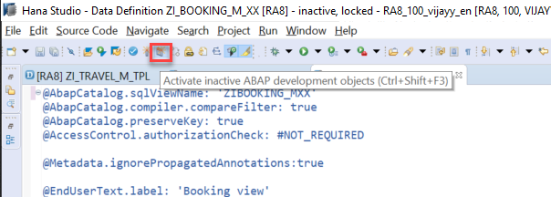
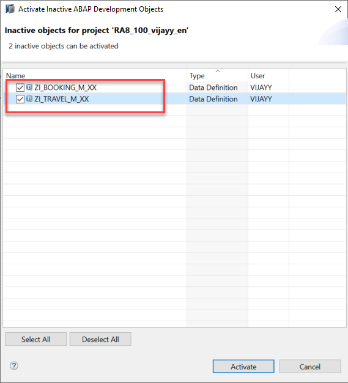
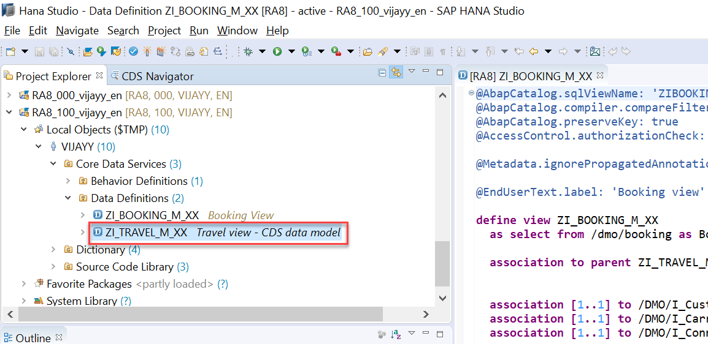
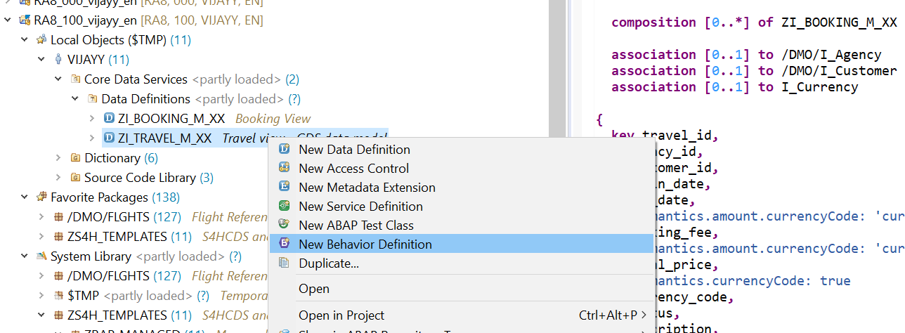
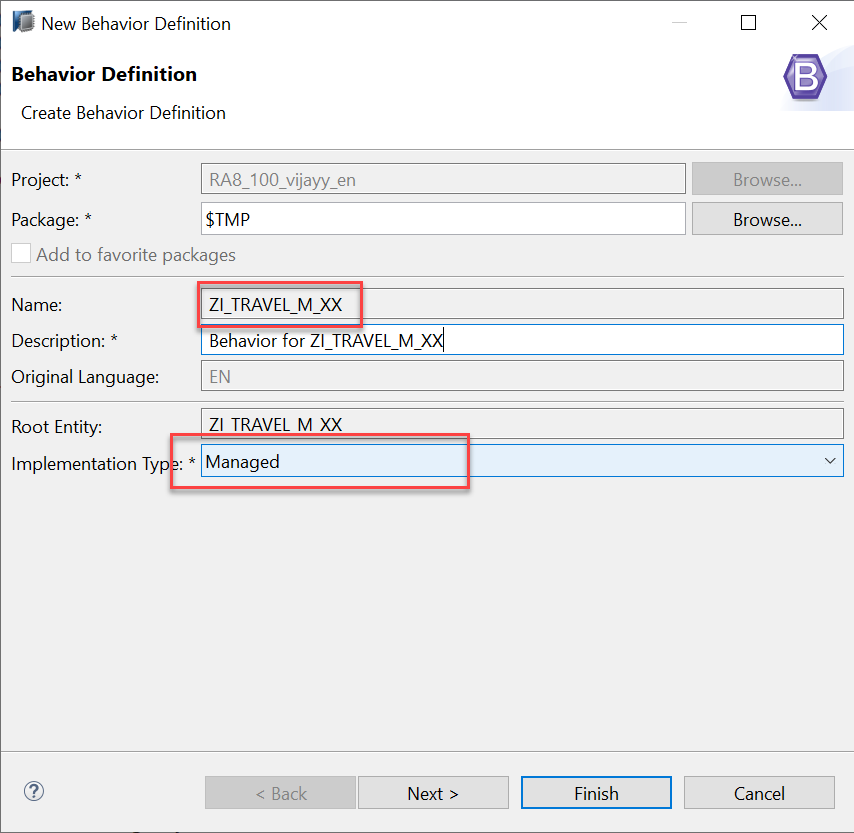

**Previous Steps**

[Defining the Data Model with CDS](/docs/Managed%20Implementation/DataModelManaged/readme.md)


# Developing Transactional App Based on Managed Scenario

* [Introduction](#introduction)
* [Exercise 1 - Providing CDS Data Model with Business Object Semantics](#exercise-1)
* [Exercise 2 - Defining Behavior definition for Travel Interface View (BDEF Interface)](#exercise-2)
* [Syntax for Defining Managed Transactional Behavior](#exercise-3)

<a id="introduction"></a>
# Introduction 
In this module, we will limit our focus to modeling an elementary behavior in which only the standard operations `create()`, `update()`, and `delete()` are defined for each entity. These operations, along with some basic properties (behavior characteristics), should already be enough to obtain a ready-to-run business object.

<a id="exercise-1"></a>
# Exercise 1 - Providing CDS Data Model with Business Object Semantics
1.	The travel view defines the **root** entity of the data model and represents the root node of the corresponding (travel) business object. Add **root** syntax to Travel CDS view `ZI_TRAVEL_M_XX` (Replace XX with your initials) in case not done.
 To open the CDS view you can use shortcut `Cltr + Shift + A` and give the CDS view name

```
@AccessControl.authorizationCheck: #NOT_REQUIRED

@EndUserText.label: 'Travel view - CDS data model'

define root view ZI_TRAVEL_M_XX…
```

2.	Uncomment below line in the `ZI_TRAVEL_M_XX` Travel CDS view

```
….
composition [0..*] of ZI_Booking_M_XX as _Booking

…

```

To define a composition relationship from the root to a child entity the keyword `COMPOSITION` is used. In our example, we specify the `ZI_Booking_M_XX` as child entity in the composition `_Booking`. As a result, the booking node is defined as a direct child entity to the business object’s root. The cardinality `[0 .. *]` specifies that any number of booking instances can be assigned to each travel instance.

3.	Uncomment `_Booking` association in **ZI_TRAVEL_M_XX CDS** View and Save the changes using shortcut `Ctrl+S`

```
/* Associations */
 _Booking,
```

4.	Save the Travel CDS View using shortcut `Ctrl+S`
5.	Open `ZI_BOOKING_M_XX`  CDS view you can use shortcut `Cltr + Shift + A` and give the CDS view name
6.	Uncomment Below link in booking CDS View

```
…
association to parent ZI_Travel_M_XX    as _Travel       on  $projection.travel_id     = _Travel.travel_id
…
```

In the data definition of the root entity **ZI_TRAVEL_M_XX**, we specified the booking entity **ZI_BOOKING_M_XX** as a composition child entity. Reversely, this relationship requires an association to their compositional parent entity – from the child entity. This relationship is expressed by the keyword `ASSOCIATION TO PARENT`.

7.	Uncomment parent association and `LastChangedAt` field in Booking CDS view and save the changes using shortcut `Ctrl+S`. 
```
….
      _Travel.lastchangedat,   -- Take over the ETag from parent
      
      /* Associations */
      _Travel,
…..
```

8.	Click on icon **Activate Inactive ABAP Development Objects (Ctrl + Shift + F3 )** to activate both Travel and Booking CDS View



9.  Select Travel - `ZI_TRAVEL_M_XX`, Booking - `ZI_BOOKING_M_XX` CDS View and click on Activate button then both CDS view will be activated.



#### Solution 
Solution for this exercise can be found [here](/docs/Managed%20Implementation/DevelopingTransactionalAppM/solutions/readme.md)

<a id="exercise-2"></a>
# Exercise 2 - Defining Behavior definition for Travel Interface View (BDEF Interface)
1.	In the Project Explorer view of your ABAP project (or ABAP Cloud Project), select the node for the data definition that defines the root entity **ZI_TRAVEL_M_XX**.



2.	Open the context menu and choose **New Behavior Definition** to launch the behavior definition creation wizard.



3.	Select Implementation Type as **Managed** as shown below and click on Finish.



4.	Behavior definition for Travel and Booking Business Objects gets created as shown below:

```
managed; // implementation in class zbp_i_travel_m_xx unique;

define behavior for ZI_TRAVEL_M_XX //alias <alias_name>
persistent table /DMO/TRAVEL
//lock master
//authorization master ( instance )
//etag master <field_name>
{
  create;
  update;
  delete;
  association _Booking { create; }
}
```

```
define behavior for ZI_BOOKING_M_XX //alias <alias_name>
//persistent table <???>
//lock dependent by <association>
//authorization dependent by <association>
//etag master <field_name>
{
  update;
  delete;
  field ( readonly ) travel_id;
  association _Travel;
}
```
**Travel Behavior Definition:** 

•	The source code of the behavior definition consists of a header information and two definitions for entity behavior: one for the root travel entity and one for the child entities booking– corresponding to the composition tree of the business object.

•	Note that for each entity of the composition tree, the transactional behavior can be defined in the behavior definition at most once.

•	All required transactional operations of an individual business object’s node are specified in the same behavior definition (that is introduced by the keyword `DEFINE BEHAVIOR FOR ...` ).

•	The header specifies managed implementation type of our business object’s provider since we are going to implement all essential parts of an application from scratch.

•	For this implementation type, all required standard operations (create, update, delete) and create by association must only be specified in the behavior definition to obtain a ready-to-run business object.

•	Our **TRAVEL** business object refers to the underlying CDS data model, which is represented by root entity `ZI_TRAVEL_M_XX`. All data changes related to this entity that result from transactional behavior are stored in the database table /DMO/TRAVEL.

•	The transactional handling of the business object's root entity travel is mainly determined by the standard operations create, update, and delete. The fact that in our scenario new instances of the booking child entity should also be created for a specific travel instance is considered by the addition of the _Booking association. The keyword `{create;}` declares that this association is create-enabled what exactly means that instances of the associated bookings can only be created by a travel instance.

**Booking Behavior Definition:** 

•	The sub node of TRAVEL business object structure refers to the corresponding data model for bookings that is represented by the child entity ZI_BOOKING_M_XX.

•	The transactional handling of child entity - booking is determined by the standard operation update and delete.

•	All data changes related to booking entity that result from transactional behavior are stored in the database table `/dmo/booking`.

5.	Uncomment `lock master`

```
…
lock master
…
```

Uncommenting this will enable lock on your Transactional behavior, once you enable this line and then we will later check once our application is ready.

6. Uncomment `etag master <field_name>` and replace `<field_name>` with `lastchangedat` in the root behavior.

```
etag master lastchangedat

```

7.	Uncomment `persistent table <???>` and add table name `/dmo/booking`
```
….
persistent table /dmo/booking
….
```
All data changes related to booking entity that result from transactional behavior are stored in the database table `/dmo/booking`.

8.	Uncomment `lock dependent by <association>` and replace `<association>` with `_Travel`

```
…
lock dependent by _Travel
….
```

9.Uncomment `etag master <field_name>` and replace `<field_name>` with `lastchangedat` in the booking behavior.

```
etag master lastchangedat

```

10.	Click the activation button or use the shortcut `Ctrl + F3` to activate the behavior definition.

#### Solution 
Solution for this exercise can be found [here](/docs/Managed%20Implementation/DevelopingTransactionalAppM/solutions/readme.md)

<a id="exercise-3"></a>
# Syntax for Defining Managed Transactional Behavior

To define the transactional behavior for a CDS Entity for managed implementation type, the following syntax is used:

```
/* Header of behavior definition */
[implementation] managed;

/* Definition of entity behavior */
define behavior for CDSEntity [alias AliasName]

/* Entity properties */
[implementation in class ABAP_CLASS_NAME [unique] ]
persistent table DB_TABLE_NAME
[etag {master Field | dependent by _Association}]
lock {master Field [unmanaged] | dependent by _Association}
[authorization {master(instance)|dependent by _Association}] 


{
/* Static field control */
  [field (read only | mandatory) field1[, field2, ..., fieldn];]
/* Dynamic field control */
  [field (features: instance) field1[, field2, ..., fieldn];]
/* Managed Early Numbering */
  field ( [readonly,] numbering:managed ) keyfield1[, keyfield2, ..., keyfieldn];]; 

/* Mapping entity's field types with table field types */
   mapping for DB_TABLE_NAME corresponding;

/* Standard operations */
  [internal] create;                  
  [internal] update;
  [internal] delete;

/* Actions */ 
  action ActionName;  

/* Associations */ 
  [association AssociationName [abbreviation AbbreviationName] {[create;] } ]

/* Validations */
   // (1) validations for triggers at field level 
      validation ValidationName on save { field f1, f2, ..., fn; } 

   // (2) validations for triggers at operation level
      validation ValidationName on save { create; update; delete; }

   // (3) combined trigger usage
      validation ValidationName on save { create; field f1; }

/* Determinations */
  // (1) determination for triggers at field level 
     determination DeterminationName on (save | modify) { field f1, f2, ..., fn; }

  // (2) determination for triggers at operation level 
     determination DeterminationName on (save | modify) { create; update; delete; }

  // (3) combined trigger usage
     determination DeterminationName on (save | modify) { create; field f1; }

}
```

**Next Steps**

[Developing a Projection Layer for Flexible Service Consumption](/docs/Managed%20Implementation/DevelopingProjectionLayer/README.md)
