**Previous Step**

[Defining Business Services Based on Processor Projections](/docs/Managed%20Implementation/DefiningBusinessServicesM/README.md)

# Developing Validations, Actions, Determinations and Feature Control

* [Exercise 1 - Implementing the Action createTravelByTemplate](#exercise-1)
* [Exercise 2 - Implementing the Action acceptTravel](#exercise-2)
* [Exercise 3 - Implementing the Action rejectTravel](#exercise-3)
* [Exercise 4 - Modeling Static and Dynamic Feature Control](#exercise-4)
* [Exercise 5 - Implementing Validations](#exercise-5)
* [Exercise 6 - Implementing the Determination](#exercise-6)


<a id="exercise-1"></a>
# Exercise 1 - Implementing the Action createTravelByTemplate

This action provides a template for creating a new travel based on an already existing travel instance.

Actions are specified as non-standard operations in behavior definitions by using the following syntax:

```
[implementation] managed;
define behavior for CDSEntity [alias AliasedEntityName]
implementation in class ABAP_ClASS_NAME [unique] 
...
{
 [static] [internal] action ActionName 
           [parameter {InputParameterEntity | $self)} ] 
           [result [cardinality] {OutputParameterEntity | $self}]; 
...      
}
```

1.	Make below changes to the behavior definition `ZI_TRAVEL_M_XX`, 
   - Change the class name in the first line to `zcl_bp_travel_m_xx`
   - Add action `createTravelByTemplate` as defined below
   - Add behavior implementation class to the Booking behavior
         `implementation in class zcl_bp_booking_m_xx unique`
   - provide alias names for both travel and booking behavior as mentioned below
   - Add `field ( readonly ) travel_id;` to booking behavior

```
managed implementation in class zcl_bp_travel_m_xx unique;

define behavior for ZI_TRAVEL_M_XX alias Travel
…
{
….
  action createTravelByTemplate result [1] $self;
…

}
define behavior for ZI_BOOKING_M_XX alias booking
implementation in class zcl_bp_booking_m_xx unique
…
{
  update;
  delete;
  field ( readonly ) travel_id;

}
```

2.	Click the activation button or use the shortcut `Ctrl + F3` to activate the behavior definition. 

3. Now behavior Implementation class should be created to implement action createTravelByTemplate. In your ABAP project (or ABAP Cloud Project), select the relevant behavior definition node ZI_TRAVEL_M_XX in Project Explorer.


4.	Open the context menu and choose `New Behavior Implementation` to launch the creation wizard.


5.	Give behavior implementation name `ZCL_BP_TRAVEL_M_XX`(Replace XX with your Initials)  as below and click on Finish.

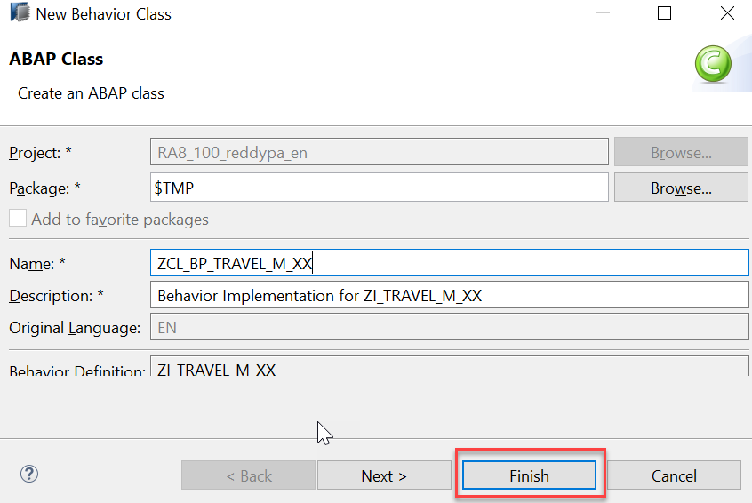

6.	Select the `Global class` section to see the generated code.


Compared to the standard ABAP class, the generated behavior pool (in our case `ZCL_BP_TRAVEL_M_XX`) provides you with an extension `FOR BEHAVIOR OF`.

The real substance of a behavior pool is in `Local Types` (there is currently no implementation yet). Here you can implement special local classes, namely handler classes for additional operations (such as actions), validations and determinations that are triggered at specific points in time within the interaction phase.

Note that these classes can be instantiated or invoked only by the ABAP runtime environment (virtual machine).

7.	Click the activation button or use the shortcut `Ctrl + F3` to activate the class.

8.	To Implement action `createTravelByTemplate` open behavior implementation class `zcl_bp_travel_m_xx` `Local Types` as shown below and paste the below code.

```
CLASS lhc_travel DEFINITION INHERITING FROM cl_abap_behavior_handler.

  PRIVATE SECTION.

    METHODS create_travel_by_template FOR MODIFY IMPORTING keys FOR ACTION travel~createTravelByTemplate RESULT result.

ENDCLASS.

CLASS lhc_travel IMPLEMENTATION.

  METHOD create_travel_by_template.

    SELECT MAX( travel_id ) FROM /dmo/travel INTO @DATA(lv_travel_id). "#EC CI_NOWHERE

    READ ENTITIES OF zi_travel_m_xx IN LOCAL MODE
      ENTITY travel
         FIELDS ( travel_id
                  agency_id
                  customer_id
                  booking_fee
                  total_price
                  currency_code )
           WITH CORRESPONDING #( keys )
         RESULT    DATA(lt_read_result)
         FAILED    failed
         REPORTED  reported.

    DATA(lv_today) = cl_abap_context_info=>get_system_date( ).

    DATA lt_create TYPE TABLE FOR CREATE ZI_Travel_M_XX\\travel.

    lt_create = VALUE #( FOR row IN  lt_read_result INDEX INTO idx

                             ( %cid = row-travel_id
                               travel_id      = lv_travel_id + idx
                               agency_id      = row-agency_id
                               customer_id    = row-customer_id
                               begin_date     = lv_today
                               end_date       = lv_today + 30
                               booking_fee    = row-booking_fee
                               total_price    = row-total_price
                               currency_code  = row-currency_code
                               description    = 'Enter your comments here'
                               status = 'O' ) ). " Open


    MODIFY ENTITIES OF zi_travel_m_xx IN LOCAL MODE
        ENTITY travel
           CREATE FIELDS (    travel_id
                              agency_id
                              customer_id
                              begin_date
                              end_date
                              booking_fee
                              total_price
                              currency_code
                              description
                              status )
           WITH lt_create
         MAPPED   mapped
         FAILED   DATA(failed_modify)
         REPORTED DATA(reported_modify).

    failed-travel   = CORRESPONDING #( BASE ( failed-travel )   failed_modify-travel   MAPPING travel_id = %cid ).
    reported-travel = CORRESPONDING #( BASE ( reported-travel ) reported_modify-travel MAPPING travel_id = %cid ).

    READ ENTITIES OF zi_travel_m_xx IN LOCAL MODE
      ENTITY travel
        ALL FIELDS WITH
        CORRESPONDING #( mapped-travel )
    RESULT DATA(lt_read_created).

    result = VALUE #( FOR key IN  mapped-travel  INDEX INTO idx
                               ( %cid_ref = keys[ KEY entity %key = key-%cid ]-%cid_ref
                                 %key     = key-%cid
                                 %param-%tky   = key-%tky ) ) .

    result = CORRESPONDING #( result FROM lt_read_created USING KEY entity  %key = %param-%key MAPPING %param = %data EXCEPT * ).

ENDMETHOD.

ENDCLASS.
```

Replace XX with your initials.

9.	Click the activation button or use the shortcut `Ctrl + F3` to activate the behavior definition. 
10.	To enable action in UI, add action using below syntax in Travel Processor behavior Definition `ZC_TRAVEL_PROCESSOR_M_XX`.

```
projection;

define behavior for ZC_TRAVEL_PROCESSOR_M_XX //alias <alias_name>
{
….
use action createTravelByTemplate;
…
}
```

11.	Click the activation button or use the shortcut `Ctrl + F3` to activate the behavior definition.
12. To enable action for UI consumption following UI annotation needs to be exposed to the consumer in Travel Processor Projection CDS View `ZC_TRAVEL_PROCESSOR_M_XX`.

```
@UI: {
          lineItem:       […..
                            { type: #FOR_ACTION, dataAction: 'createTravelByTemplate', label: 'Create Travel by Template' } ]
         …. }
```
This annotation has already been added to the view. No action is needed from the participant's side.

13.	Click the `preview` button by selecting the Entity type or double click the entity in the service binding to check how the UI of a Fiori application looks like or refresh the browser where Fiori app is displayed.

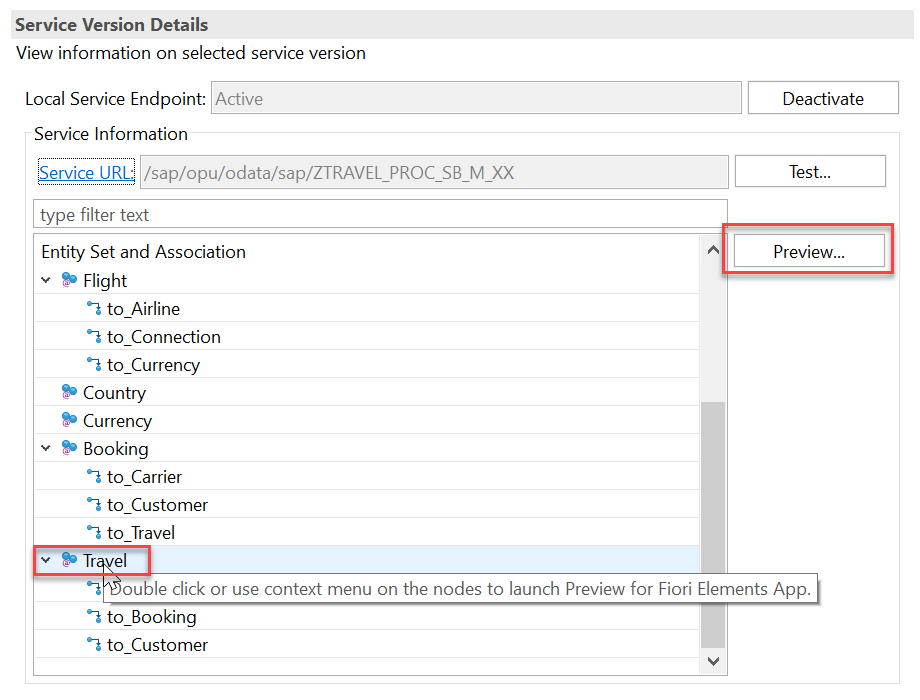

14.	The UI screen provides the button `Create Travel by Template` for the action as shown in the figure below.


15.	Click on `Go` button and select any travel item and click on button `Create Travel by Template` button to copy the travel instance.

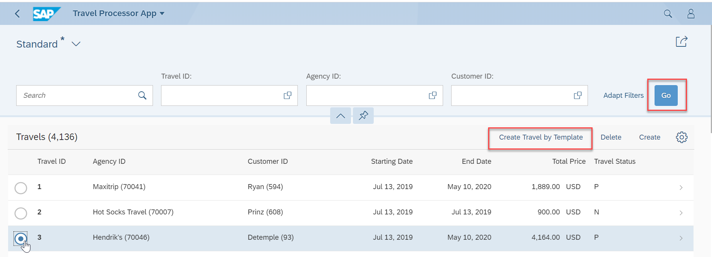

16.	In change mode (after the user clicks the `Edit` button on Fiori UI’s object page), the end user can change the relevant travel fields as shown in the figure below.


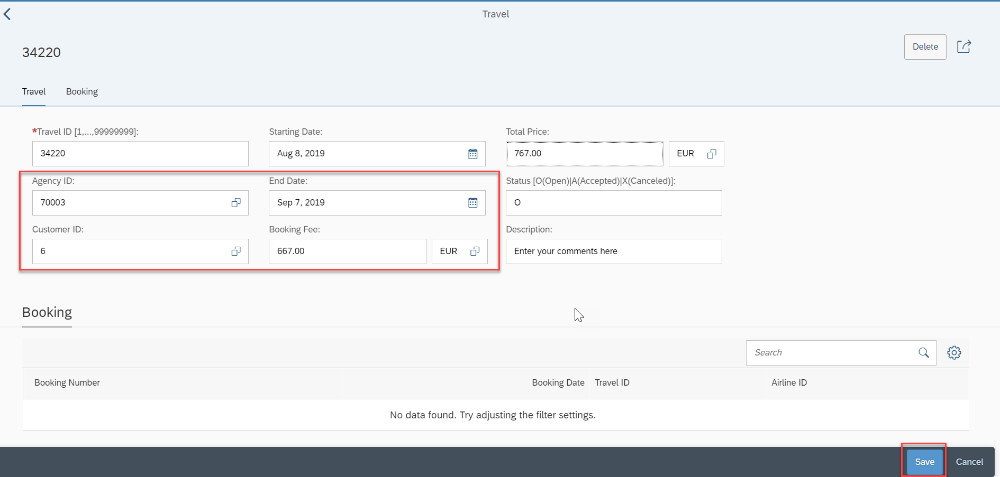

17.	As soon as the user chooses the `Save` button on the object page, the data is persisted in the corresponding database table and a travel instance with a new `Travel ID` is created.


#### Solution 
Solution for this exercise can be found [here](/docs/Managed%20Implementation/DevelopingValidationsM/Solutions/Exercise-2)

<a id="exercise-2"></a>
# Exercise 2 - Implementing the Action acceptTravel
This action provides the end user with the option of accepting individual travels without switching to `EDIT` mode.
1.	Make below changes to the behavior definition `ZI_TRAVEL_M_XX`, the action `acceptTravel` is defined as follows: 

```
managed implementation in class zcl_bp_travel_m_xx unique;

define behavior for ZI_TRAVEL_M_XX alias Travel
…
{
….
    action acceptTravel result [1] $self;
…

}
```

Note that `implementation in class zcl_bp_travel_m_xx unique;` syntax is mandatory in the behavior definition which represent behavior implementation class and `alias Travel` is Optional.

2.	Click the activation button or use the shortcut `Ctrl + F3` to activate the behavior definition. 
3.	To Implement action `acceptTravel` open behavior implementation class `zcl_bp_travel_m_xx` `Local Types` as shown below and paste the below code.

```
CLASS lhc_travel DEFINITION INHERITING FROM cl_abap_behavior_handler.

….
METHODS accept_travel FOR MODIFY IMPORTING keys FOR ACTION travel~acceptTravel  RESULT result.
…


ENDCLASS.

CLASS lhc_travel IMPLEMENTATION.


    ….

METHOD accept_travel.

    " Modify in local mode
     MODIFY ENTITIES OF zi_travel_m_xx IN LOCAL MODE
      ENTITY Travel
       UPDATE FIELDS (  status )
       WITH VALUE #( FOR key IN keys ( %tky          = key-%tky
                                       status = 'A' ) )
      FAILED failed
      REPORTED reported.

    "Read changed data for action result
    READ ENTITIES OF zi_travel_m_xx IN LOCAL MODE
      ENTITY Travel
        ALL FIELDS WITH
        CORRESPONDING #( keys )
      RESULT DATA(lt_travel).

    result = VALUE #( FOR travel IN lt_travel ( %tky   = travel-%tky
                                                %param = travel ) ).
  ENDMETHOD.
…

ENDCLASS.
```

Replace XX with your initials.

4.	Click the activation button or use the shortcut `Ctrl + F3` to activate the behavior definition. 

#### Solution 
Solution for this exercise can be found [here](/docs/Managed%20Implementation/DevelopingValidationsM/Solutions/Exercise-3)

<a id="exercise-3"></a>
# Exercise 3 - Implementing the Action rejectTravel

This action provides the end user with the option of rejecting individual travels without switching to `EDIT` mode.

1.	Make below changes to the behavior definition `ZI_TRAVEL_M_XX`, the action `rejectTravel` is defined as follows: 

```
managed implementation in class zcl_bp_travel_m_xx unique;

define behavior for ZI_TRAVEL_M_XX alias Travel
…
{
….
    action rejectTravel result [1] $self;
…

}

```

Note that `implementation in class zcl_bp_travel_m_xx unique;` syntax is mandatory in the behavior definition which represent behavior implementation class and `alias Travel` is Optional.

2.	Click the activation button or use the shortcut `Ctrl + F3` to activate the behavior definition. 
3.	To Implement action `rejectTravel` open behavior implementation class `zcl_bp_travel_m_xx` `Local Types` as shown below and paste the below code.

```
CLASS lhc_travel DEFINITION INHERITING FROM cl_abap_behavior_handler.

….
METHODS reject_travel FOR MODIFY IMPORTING keys FOR ACTION travel~rejectTravel  RESULT result.
…


ENDCLASS.

CLASS lhc_travel IMPLEMENTATION.


    ….
METHOD reject_travel.

 " Modify in local mode
    MODIFY ENTITIES OF zi_travel_m_xx IN LOCAL MODE
 ENTITY Travel
   UPDATE FIELDS (  status )
   WITH VALUE #( FOR key IN keys ( %tky          = key-%tky
                                   status = 'X' ) )
FAILED failed
REPORTED reported.

    "Read changed data for action result
    READ ENTITIES OF zi_travel_m_xx IN LOCAL MODE
      ENTITY Travel
        ALL FIELDS WITH
        CORRESPONDING #( keys )
      RESULT DATA(lt_travel).

    result = VALUE #( FOR travel IN lt_travel ( %tky   = travel-%tky
                                                %param = travel ) ).
  ENDMETHOD.
…

ENDCLASS.

```
Replace XX with your initials.

4.	Click the activation button or use the shortcut `Ctrl + F3` to activate the behavior definition. 

#### Solution 
Solution for this exercise can be found [here](/docs/Managed%20Implementation/DevelopingValidationsM/Solutions/Exercise-4)

<a id="exercise-4"></a>
# Exercise 4 - Modeling Static and Dynamic Feature Control

As an application developer you may want to determine, which entities of your business object should be create-, delete- and update-enabled, so that they can be modified during consumption using EML or OData services. In addition, you also may want control which (UI) fields of an entity are read-only or which actions in which usage scenarios are enabled or disabled for execution by the end users.

In ABAP RESTful programming model, the feature control is precisely the means of accomplishing such tasks. It allows you to control the visibility and changeability of fields, operations or entire entities.

Depending on whether feature control refers to specific instances or is independent of each entity instance, we distinguish between `instance-bound` and `static feature control`.

The availability of feature control values is modelled in a behavior definition. Unlike static, instance-bound feature control requires not only a definition but also an implementation in a handler class of the behavior pool. Therefore, we also talk about `dynamic feature control` in case of instance-bound feature control.

Both, static and dynamic feature control is defined for different levels (entity, field, or action level) in the behavior definition by using the following syntax:

```
[implementation] managed;
define behavior for CDSEntity [alias AliasName]
implementation in class ABAP_ClASS [unique] 
...
{
/* (1) Feature control at entity level */
/* Static operation control*/
  internal create
  internal update
  internal delete

/* or (instance-based) dynamic operation control: implementation required! */
  create (features: instance);
  update (features: instance);
  delete (features: instance);

/* (2) Feature control at field level */
/* Static field control */
  field (read only | mandatory) f1[, f2, ..., fn];

/* or dynamic field control: implementation required! */
  field (features: instance) f1[, f2, ..., fn];

/* (3) Feature control for actions */
/* Static action control */
  internal action ActionName [...]

/* or dynamic action control: implementation required! */
  action ( features: instance ) ActionName [... ]      
}
```

1.	Add below feature control to Behavior Definition `ZI_Travel_M_XX`. Also add `implementation in class zcl_bp_booking_m_xx unique` after define behavior for Booking `define behavior for ZI_BOOKING_M_XX alias booking`.
```
managed implementation in class zcl_bp_travel_m_xx unique;

define behavior for ZI_TRAVEL_M_XX alias Travel
persistent table /DMO/TRAVEL
lock master
//authorization master ( instance )
//etag <field_name>
{
  ….
  
  // administrative fields: read only
  field ( readonly ) lastchangedat, lastchangedby, createdat, createdby;

  // mandatory fields that are required to create a travel
  field ( mandatory ) agency_id, status, booking_fee, currency_code;

  // dynamic field control
  field (features : instance ) travel_id;
  
  // dynamic action control
  action  ( features: instance ) acceptTravel result [1] $self;
  action  ( features: instance ) rejectTravel result [1] $self;
…
  
}

define behavior for ZI_BOOKING_M_XX alias booking
implementation in class zcl_bp_booking_m_xx unique 
persistent table /dmo/booking
lock dependent( travel_id = travel_id)
//authorization dependent( <local_field_name> = <target_field_name> )
//etag <field_name>
{
  …
  
  // static field control
  field ( mandatory ) carrier_id, connection_id, flight_date;
  field ( readonly ) travel_id;

  // dynamic field control
  field (features : instance ) booking_id, booking_date, customer_id;
…
}
```

For the travel entity, we define all admin fields as read-only, whereas the fields that are required for creating a travel instance are defined as mandatory.

The key field `travel_id` plays a special role and is intended for dynamic field control. In the corresponding implementation, we will distinguish whether the travel instance already exists (in case of EDIT) or whether it should still be created.

Examples of dynamic action control are the two methods `acceptTravel` and `rejectTravel`. Depending on the status value (overall_status), these actions can become enabled or disabled.

For the booking enitity, we limit ourselves to defining static and dynamic control at field level only.

2.	Click the activation button or use the shortcut `Ctrl + F3` to activate the behavior definition. 
3.	To Implement feature control for travel open behavior implementation class `zcl_bp_travel_m_xx` `Local Types` as shown below and paste the below code.

```
CLASS lhc_travel DEFINITION INHERITING FROM cl_abap_behavior_handler.

….
METHODS get_features FOR FEATURES IMPORTING keys REQUEST requested_features FOR travel RESULT result.
…


ENDCLASS.

CLASS lhc_travel IMPLEMENTATION.


    ….
METHOD get_features.
READ ENTITIES OF zi_travel_m_xx IN LOCAL MODE
    ENTITY Travel
    FIELDS ( status )
    WITH CORRESPONDING #( keys )
    RESULT DATA(lt_travel_result)
    FAILED failed.

    result = VALUE #( FOR ls_travel IN lt_travel_result
                       (         %tky                   = ls_travel-%tky
                         %field-travel_id               = if_abap_behv=>fc-f-read_only
                         %features-%action-rejectTravel = COND #( WHEN ls_travel-status = 'X'
                                                                    THEN if_abap_behv=>fc-o-disabled ELSE if_abap_behv=>fc-o-enabled  )
                         %features-%action-acceptTravel = COND #( WHEN ls_travel-status = 'A'
                                                                    THEN if_abap_behv=>fc-o-disabled ELSE if_abap_behv=>fc-o-enabled  )
                      ) ).
  ENDMETHOD.
…

ENDCLASS.

```

Replace XX with your initials 

4.	Click the activation button or use the shortcut `Ctrl + F3` to activate the behavior definition. 

5. Now behavior Implementation class for booking should be created to implement feature control.In your ABAP project (or ABAP Cloud Project), select the relevant behavior definition node ZI_TRAVEL_M_XX in Project Explorer.


6.	Open the context menu and choose `New Behavior Implementation` to launch the creation wizard.


7.	Give behavior implementation name `ZCL_BP_BOOKING_M_XX`(Replace XX with your Initials)  as below and click on Finish.

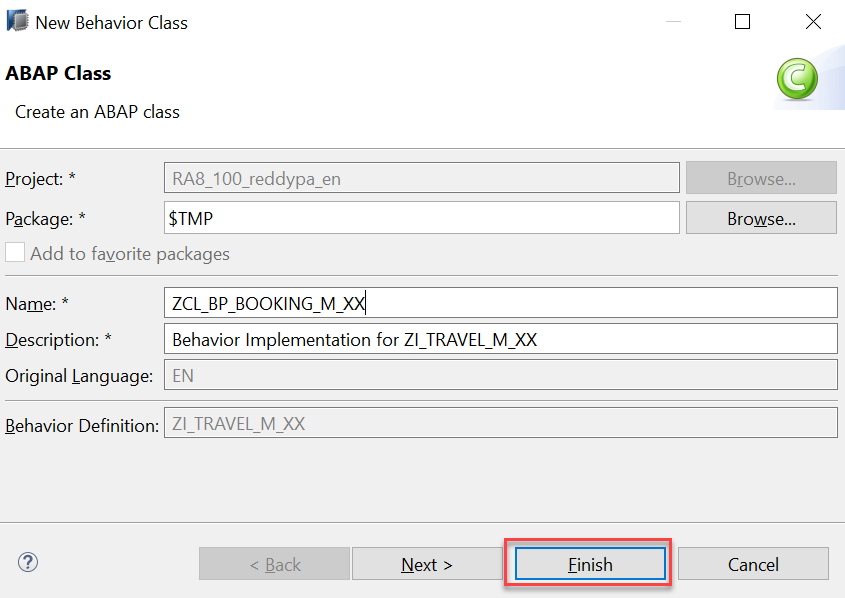

8.	Select the `Global class` section to see the generated code.

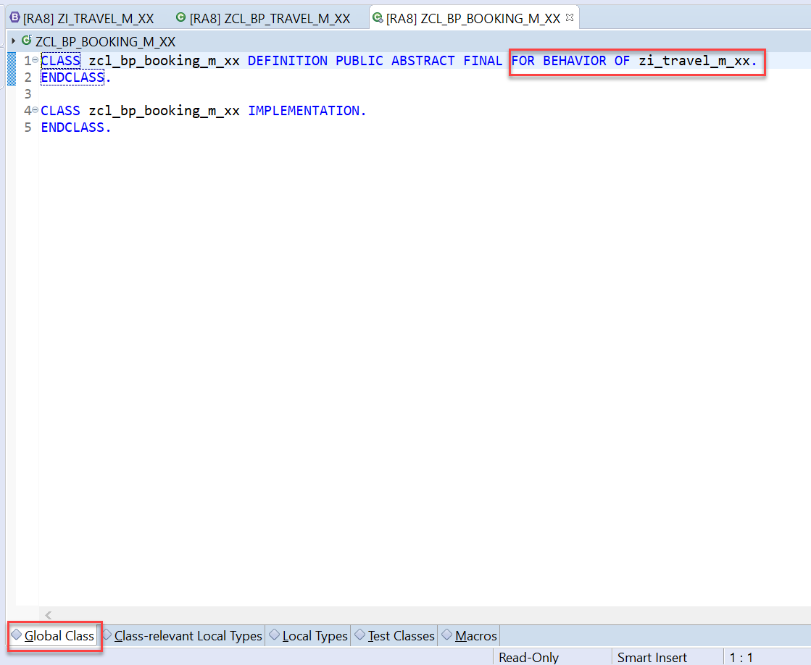

Compared to the standard ABAP class, the generated behavior pool (in our case `ZCL_BP_BOOKING_M_XX`) provides you with an extension `FOR BEHAVIOR OF`.

The real substance of a behavior pool is in `Local Types` (there is currently no implementation yet). Here you can implement special local classes, namely handler classes for additional operations (such as actions), validations and determinations that are triggered at specific points in time within the interaction phase.

Note that these classes can be instantiated or invoked only by the ABAP runtime environment (virtual machine).

9.	Click the activation button or use the shortcut `Ctrl + F3` to activate the class.
10.	To Implement feature control for booking open behavior implementation class `zcl_bp_booking_m_xx` `Local Types` as shown below and paste the below code.

```
CLASS lhc_travel DEFINITION INHERITING FROM cl_abap_behavior_handler.

  PRIVATE SECTION.
    METHODS get_features FOR FEATURES IMPORTING keys REQUEST requested_features FOR booking RESULT result.


ENDCLASS.

CLASS lhc_travel IMPLEMENTATION.


  METHOD get_features.

   READ ENTITIES OF ZI_Travel_M_XX IN LOCAL MODE
       ENTITY Booking
         FIELDS ( carrier_id )
         WITH CORRESPONDING #( keys )
       RESULT DATA(lt_booking_result)
       FAILED failed.


    result = VALUE #( FOR ls_booking IN lt_booking_result
                       (  %tky                      = ls_booking-%tky
                         %field-booking_id   = if_abap_behv=>fc-f-read_only
                         %field-booking_date = if_abap_behv=>fc-f-read_only
                         %field-customer_id  = COND #( WHEN ls_booking-carrier_id = 'AA'
                                                          THEN if_abap_behv=>fc-f-read_only
                                                          ELSE if_abap_behv=>fc-f-unrestricted  )
                      ) ).

  ENDMETHOD.

ENDCLASS.

```
Replace XX with your initials.

11.	Click the activation button or use the shortcut `Ctrl + F3` to activate the behavior definition. 
12.	Click the `preview` button by selecting the Entity type or double click the entity in the service binding to check how the UI of a Fiori application looks like or refresh the browser where Fiori app is displayed.


13.	The figure below shows the realization of the static and dynamic field control using the example of the travel object page that has been switched to `Edit` mode. All mandatory fields are marked with a red star. Since it is an already existing travel instance selected, a re-assignment of `travel ID` number is suppressed in edit mode.

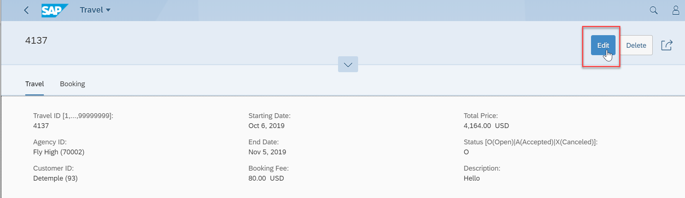

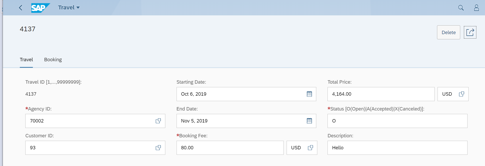

14.	The following figure shows the effect of static and dynamic field control after switching the Fiori UI object page for bookings in `Edit` mode.

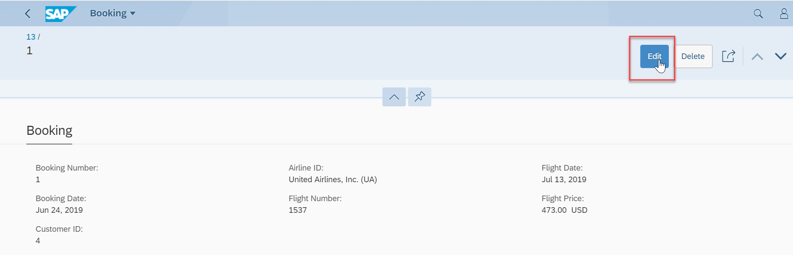

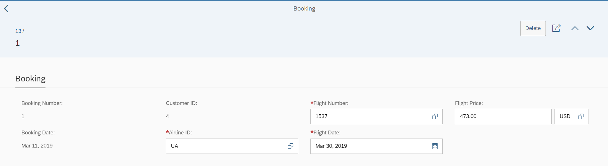

#### Solution 
Solution for this exercise can be found [here](/docs/Managed%20Implementation/DevelopingValidationsM/Solutions/Exercise-5)

<a id="exercise-5"></a>
# Exercise 5 - Implementing Validations
A validation is an implicitly executed function intended to check the data consistency of an existing instance of an entity (consistency validation). It is implicitly invoked by the business object’s framework as soon as a trigger condition at a predefined point in time is fulfilled. Validation can return messages to the consumer and reject inconsistent instance data from being saved.

Validations never modify any instance data but return the messages and keys of failed (inconsistent) entity instances.

Validations are specified for individual business object’s entities in the behavior definition by using the following syntax:

```
[implementation] managed;
define behavior for CDSEntity [alias AliasedName]
implementation in class ABAP_ClASS [unique] 
...
{
  validation ValidationName on save { field f1[, f2, ..., fn]; }
...      
}
```

**Example**

A validation is implemented to check if the customer ID referenced in the Travel order is valid. This validation is assigned to the "Travel" entity having defined update as the trigger operation on entity "Travel". As soon as a customer ID is updated by the consumer, the validation will check it and return a warning message if the ID is unknown.

1.	Add below validations to Behavior Definition `ZI_Travel_M_XX`.

```
managed implementation in class zcl_bp_travel_m_xx unique;

define behavior for ZI_TRAVEL_M_XX alias Travel
persistent table /DMO/TRAVEL
lock master
//authorization master ( instance )
//etag <field_name>
{
  ….
  
  validation validateCustomer on save { field customer_id; create; }
  validation validateDates on save { field begin_date, end_date; create; }
  validation validateStatus on save { field status; }
…
  
}

```

2.	Click the activation button or use the shortcut `Ctrl + F3` to activate the behavior definition. 
3.	To Implement valdiation for travel open behavior implementation class `zcl_bp_travel_m_xx` `Local Types` as shown below and paste the below code.

```
CLASS lhc_travel DEFINITION INHERITING FROM cl_abap_behavior_handler.

….
 METHODS validateCustomer FOR VALIDATE ON SAVE
      IMPORTING keys FOR Travel~validateCustomer.

    METHODS validateDates FOR VALIDATE ON SAVE
      IMPORTING keys FOR Travel~validateDates.

    METHODS validateStatus FOR VALIDATE ON SAVE
      IMPORTING keys FOR Travel~validateStatus.
…


ENDCLASS.

CLASS lhc_travel IMPLEMENTATION.


    ….
 METHOD validateCustomer.

    READ ENTITIES OF ZI_Travel_M_XX IN LOCAL MODE
        ENTITY Travel
          FIELDS ( customer_id )
          WITH CORRESPONDING #( keys )
        RESULT DATA(lt_travel)
        FAILED DATA(lt_failed).

    failed =  CORRESPONDING #( DEEP lt_failed  ).

    DATA lt_customer TYPE SORTED TABLE OF /dmo/customer WITH UNIQUE KEY customer_id.

    " Optimization of DB select: extract distinct non-initial customer IDs
    lt_customer = CORRESPONDING #( lt_travel DISCARDING DUPLICATES MAPPING customer_id = customer_id EXCEPT * ).
    DELETE lt_customer WHERE customer_id IS INITIAL.

    IF  lt_customer IS NOT INITIAL.
      " Check if customer ID exists
      SELECT FROM /dmo/customer FIELDS customer_id
                                FOR ALL ENTRIES IN @lt_customer
                                WHERE customer_id = @lt_customer-customer_id
      INTO TABLE @DATA(lt_customer_db).
    ENDIF.

    " Raise message for non existing customer id
    LOOP AT lt_travel INTO DATA(ls_travel).

      APPEND VALUE #(  %tky                 = ls_travel-%tky
                       %state_area          = 'VALIDATE_CUSTOMER' ) TO reported-travel.

      IF ls_travel-customer_id IS  INITIAL.
        APPEND VALUE #( %tky = ls_travel-%tky ) TO failed-travel.

        APPEND VALUE #( %tky                = ls_travel-%tky
                        %state_area         = 'VALIDATE_CUSTOMER'
                        %msg                = NEW /dmo/cm_flight_messages(
                                                                textid = /dmo/cm_flight_messages=>enter_customer_id
                                                                severity = if_abap_behv_message=>severity-error )
                        %element-customer_id = if_abap_behv=>mk-on ) TO reported-travel.

      ELSEIF ls_travel-customer_id IS NOT INITIAL AND NOT line_exists( lt_customer_db[ customer_id = ls_travel-customer_id ] ).
        APPEND VALUE #(  %tky = ls_travel-%tky ) TO failed-travel.

        APPEND VALUE #(  %tky                = ls_travel-%tky
                         %state_area         = 'VALIDATE_CUSTOMER'
                         %msg                = NEW /dmo/cm_flight_messages(
                                                                customer_id = ls_travel-customer_id
                                                                textid = /dmo/cm_flight_messages=>customer_unkown
                                                                severity = if_abap_behv_message=>severity-error )
                         %element-customer_id = if_abap_behv=>mk-on ) TO reported-travel.
      ENDIF.

    ENDLOOP.
  ENDMETHOD.

  METHOD validateDates.
    READ ENTITIES OF ZI_Travel_M_XX IN LOCAL MODE
     ENTITY Travel
       FIELDS (  begin_date end_date travel_id )
       WITH CORRESPONDING #( keys )
     RESULT DATA(lt_travel)
     FAILED DATA(lt_failed).

    failed =  CORRESPONDING #( DEEP lt_failed  ).

    LOOP AT lt_travel INTO DATA(ls_travel).

      APPEND VALUE #(  %tky               = ls_travel-%tky
                       %state_area          = 'VALIDATE_DATES' ) TO reported-travel.

      IF ls_travel-begin_date IS INITIAL.
        APPEND VALUE #( %tky = ls_travel-%tky ) TO failed-travel.

        APPEND VALUE #( %tky               = ls_travel-%tky
                        %state_area        = 'VALIDATE_DATES'
                         %msg                = NEW /dmo/cm_flight_messages(
                                                                textid = /dmo/cm_flight_messages=>enter_begin_date
                                                                severity = if_abap_behv_message=>severity-error )
                        %element-begin_date = if_abap_behv=>mk-on ) TO reported-travel.
      ENDIF.
      IF ls_travel-end_date IS INITIAL.
        APPEND VALUE #( %tky = ls_travel-%tky ) TO failed-travel.

        APPEND VALUE #( %tky               = ls_travel-%tky
                        %state_area        = 'VALIDATE_DATES'
                         %msg                = NEW /dmo/cm_flight_messages(
                                                                textid = /dmo/cm_flight_messages=>enter_end_date
                                                                severity = if_abap_behv_message=>severity-error )
                        %element-end_date   = if_abap_behv=>mk-on ) TO reported-travel.
      ENDIF.
      IF ls_travel-end_date < ls_travel-begin_date AND ls_travel-begin_date IS NOT INITIAL
                                                 AND ls_travel-end_date IS NOT INITIAL.
        APPEND VALUE #( %tky = ls_travel-%tky ) TO failed-travel.

        APPEND VALUE #( %tky               = ls_travel-%tky
                        %state_area        = 'VALIDATE_DATES'
                        %msg               = NEW /dmo/cm_flight_messages(
                                                                textid = /dmo/cm_flight_messages=>begin_date_bef_end_date
                                                                begin_date = ls_travel-begin_date
                                                                end_date   = ls_travel-end_date
                                                                severity = if_abap_behv_message=>severity-error )
                        %element-begin_date = if_abap_behv=>mk-on
                        %element-end_date   = if_abap_behv=>mk-on ) TO reported-travel.
      ENDIF.
      IF ls_travel-begin_date < cl_abap_context_info=>get_system_date( ) AND ls_travel-begin_date IS NOT INITIAL.
        APPEND VALUE #( %tky               = ls_travel-%tky ) TO failed-travel.

        APPEND VALUE #( %tky               = ls_travel-%tky
                        %state_area        = 'VALIDATE_DATES'
                         %msg                = NEW /dmo/cm_flight_messages(
                                                                begin_date = ls_travel-begin_date
                                                                textid = /dmo/cm_flight_messages=>begin_date_on_or_bef_sysdate
                                                                severity = if_abap_behv_message=>severity-error )
                        %element-begin_date = if_abap_behv=>mk-on ) TO reported-travel.
      ENDIF.

    ENDLOOP.
  ENDMETHOD.

  METHOD validateStatus.

*  READ ENTITY ZI_Travel_M_XX\\travel FROM VALUE #(
*       FOR <root_key> IN keys ( %key     = <root_key>
*                                %control = VALUE #( status = if_abap_behv=>mk-on ) ) )
*       RESULT DATA(lt_travel_result).

    READ ENTITIES OF ZI_Travel_M_XX IN LOCAL MODE
ENTITY Travel
FIELDS (  status )
WITH CORRESPONDING #( keys )
RESULT DATA(lt_travel_result)
FAILED DATA(lt_failed).

    LOOP AT lt_travel_result INTO DATA(ls_travel_result).
      CASE ls_travel_result-status.
        WHEN 'O'.  " Open
        WHEN 'X'.  " Cancelled
        WHEN 'A'.  " Accepted

        WHEN OTHERS.

          APPEND VALUE #( %tky = ls_travel_result-%tky ) TO failed-travel.

          APPEND VALUE #( %tky = ls_travel_result-%tky
                          %msg = new_message_with_text(
                                   severity = if_abap_behv_message=>severity-error
                                   text     = 'Invalid Status'
                                 )
                          %element-status = if_abap_behv=>mk-on ) TO reported-travel.
      ENDCASE.

    ENDLOOP.
  ENDMETHOD.

…

ENDCLASS.
```

Replace XX with your initials.

4.	Click the activation button or use the shortcut `Ctrl + F3` to activate the behavior definition. 
5.	Click the `preview` button by selecting the Entity type or double click the entity in the service binding to check how the UI of a Fiori application looks like or refresh the browser where Fiori app is displayed.


6.	If the user enters an invalid number as the `Customer ID`, the validation is initiated at the `Save` time and, as a result, which rejects saving of the instance data and returns a corresponding message to the user.

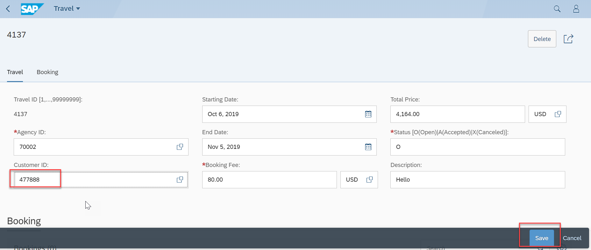

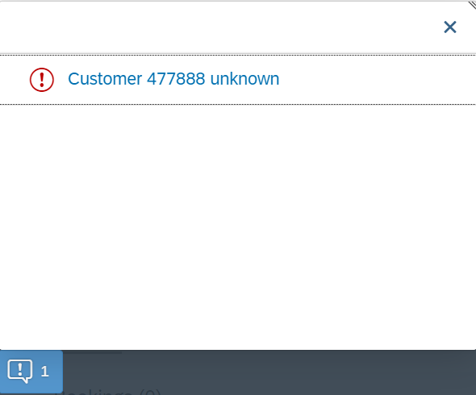

7.	If user enters start date greater than end date, then it results in below error on `Save`.

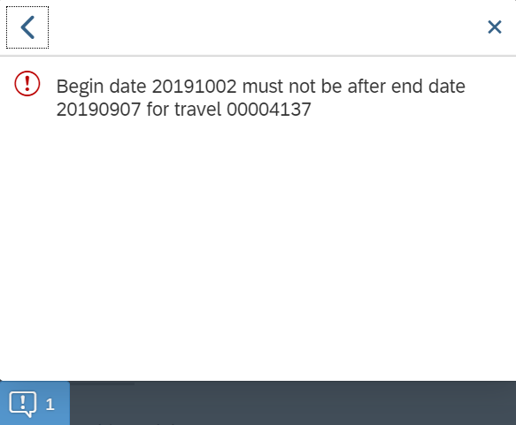

8.	If user enters invalid status, then it results in below error on `Save`.

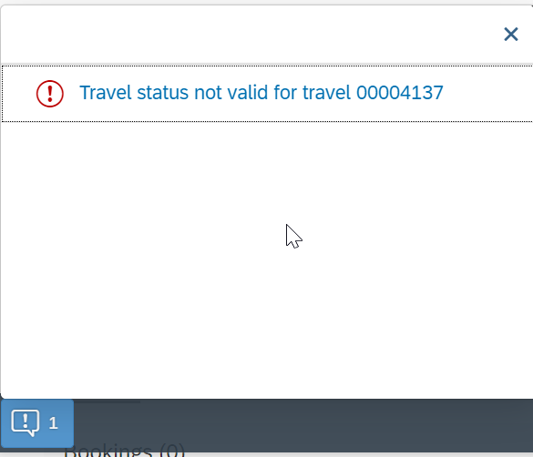

9.	If Begin date is not given in the input, then below error is shown on `Save`.

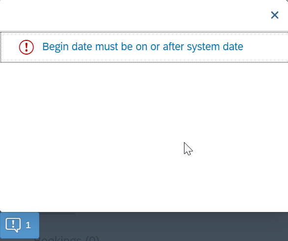


#### Solution 
Solution for this exercise can be found [here](/docs/Managed%20Implementation/DevelopingValidationsM/Solutions/Exercise-6)

<a id="exercise-6"></a>
# Exercise 6 - Implementing the Determination

A determination is an implicitly executed function that handles side effects of modified entity instances. It is invoked by the business object’s framework as soon as a determination’s trigger condition at a predefined point in time, the determination time, is fulfilled.

Determinations are triggered internally based on changes made to the entity instance of a business object. The trigger conditions are checked by business object framework at different points during the transaction cycle, depending on the determination time and the changing operations on the relevant entity instances. For each determination, it is necessary to specify both the determination time and the changes that form the trigger condition. A trigger condition consists of a list of fields belonging to the same entity the determination is assigned to and the changing operations that include creating or updating entity instances. We call this operations trigger operations.

In case a field is changed (after creation or update), the condition is fulfilled. The framework evaluates the triggering condition of all determinations at certain points in time (determination time). For determinations, this is today either after each modification or during the save phase.

You can use a determination primarily to compute data that is derived from the values of other fields. The determined fields and the determining fields either belong to the same entity or to different entities of a business object.

As a result, determination can modify entity instances and return transition messages (error, warning, information, success).

Determinations are specified for individual business object’s entities in the behavior definition by using the following syntax:

```
[implementation] managed;
define behavior for CDSEntity [alias AliasedName]
implementation in class ABAP_ClASS [unique] 
...
{
  // (1) determination for triggers at field level 
  determination DeterminationName on (save | modify) { field f1[, f2, ..., fn] ; }

  // (2) determination for triggers at entity level 
  determination DeterminationName on (save | modify) { create; }
...      
}

```

1.	In the behavior definition `ZI_TRAVEL_M_XX`, the determination on the booking entity is defined as follows:

```
…
define behavior for ZI_BOOKING_M_XX alias booking
implementation in class zcl_bp_booking_m_xx unique
persistent table /dmo/booking
lock dependent ( travel_id = travel_id )
//authorization dependent( <local_field_name> = <target_field_name> )
//etag <field_name>
{
  
  …
  determination calculateTotalFlightPrice on modify { field flight_price, currency_code; create; }
…
}
```

The determination `calculateTotalFlightPrice` on the booking entity is intended to handle the calculation of total price of all flight bookings that belong to the selected travel. The determination will be triggered by on modify as determination time when creating new booking instances or updating the flight price value or when changing the currency. In other words: both fields `flight_price` and `currency_code` serve as trigger fields and form together with create and update operations the trigger condition for the determination.

2.	Click the activation button or use the shortcut `Ctrl + F3` to activate the behavior definition. 

3.	To Implement determination for booking open behavior implementation class `zcl_bp_booking_m_xx` `Local Types` as shown below and paste the below code.

```
CLASS lhc_booking DEFINITION INHERITING FROM cl_abap_behavior_handler.
  PRIVATE SECTION.

….
    METHODS calculate_total_flight_price FOR DETERMINATION booking~calculateTotalFlightPrice
      IMPORTING keys FOR booking.

ENDCLASS.

CLASS lhc_booking IMPLEMENTATION.


  ….

  METHOD calculate_total_flight_price.


 TYPES: BEGIN OF ty_amount_per_currencycode,
             amount        TYPE /dmo/total_price,
             currency_code TYPE /dmo/currency_code,
           END OF ty_amount_per_currencycode.

    DATA: amount_per_currencycode TYPE STANDARD TABLE OF ty_amount_per_currencycode.


    " Read all relevant travel instances.
    READ ENTITIES OF zi_travel_m_xx IN LOCAL MODE
         ENTITY Travel
            FIELDS ( booking_fee currency_code )
            WITH CORRESPONDING #( keys )
         RESULT DATA(lt_travel).


    DELETE lt_travel WHERE currency_code IS INITIAL.

    LOOP AT lt_travel ASSIGNING FIELD-SYMBOL(<fs_travel>).
      " Set the start for the calculation by adding the booking fee.
      amount_per_currencycode = VALUE #( ( amount        = <fs_travel>-booking_fee
                                           currency_code = <fs_travel>-currency_code ) ).

      " Read all associated bookings and add them to the total price.
      READ ENTITIES OF zi_travel_m_xx IN LOCAL MODE
        ENTITY Travel BY \_Booking
          FIELDS ( flight_price currency_code )
        WITH VALUE #( ( %tky = <fs_travel>-%tky ) )
        RESULT DATA(lt_booking).

      LOOP AT lt_booking INTO DATA(booking) WHERE currency_code IS NOT INITIAL.
        COLLECT VALUE ty_amount_per_currencycode( amount        = booking-flight_price
                                                  currency_code = booking-currency_code ) INTO amount_per_currencycode.
      ENDLOOP.


      CLEAR <fs_travel>-total_price.
      LOOP AT amount_per_currencycode INTO DATA(single_amount_per_currencycode).
        " If needed do a Currency Conversion
        IF single_amount_per_currencycode-currency_code = <fs_travel>-currency_code.
          <fs_travel>-total_price += single_amount_per_currencycode-amount.
        ELSE.
          TRY  .
              /dmo/cl_flight_amdp=>convert_currency(
                 EXPORTING
                   iv_amount                   =  single_amount_per_currencycode-amount
                   iv_currency_code_source     =  single_amount_per_currencycode-currency_code
                   iv_currency_code_target     =  <fs_travel>-currency_code
                   iv_exchange_rate_date       =  cl_abap_context_info=>get_system_date( )
                 IMPORTING
                   ev_amount                   = DATA(total_booking_price_per_curr)
                ).
            CATCH cx_amdp_execution_failed.

          ENDTRY.
          <fs_travel>-total_price += total_booking_price_per_curr.
        ENDIF.
      ENDLOOP.
    ENDLOOP.

    " write back the modified total_price of travels
    MODIFY ENTITIES OF ZI_TRAVEl_M_XX IN LOCAL MODE
      ENTITY travel
        UPDATE FIELDS ( total_price )
        WITH CORRESPONDING #( lt_travel ).

  ENDMETHOD.

..

ENDCLASS.

```

Replace XX with your initials.

4.	Click the activation button or use the shortcut `Ctrl + F3` to activate the behavior definition. 

5.	Click the `preview` button by selecting the Entity type or double click the entity in the service binding to check how the UI of a Fiori application looks like or refresh the browser where Fiori app is displayed.


6.	The figure below refers to the starting point of viewing with a newly created travel instance with the initial amount (Total Price) and the travel currency 0.00 EUR.


7.	If a user adds a flight booking to the travel, then also the travel’s `Total Price` is updated.

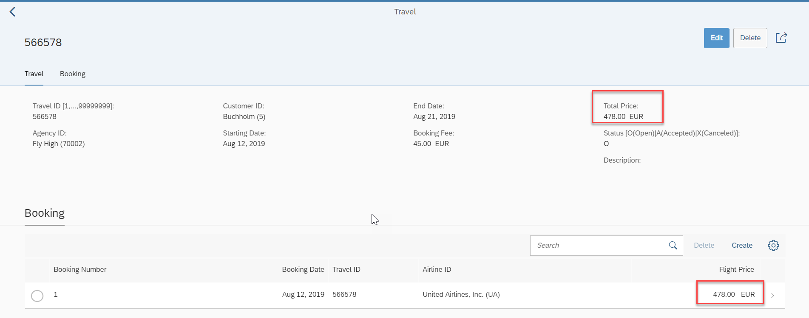.

8.	If the user switches the booking’s object page to `edit` mode and then changes the Flight Price, then the Total Price is also updated at root level.

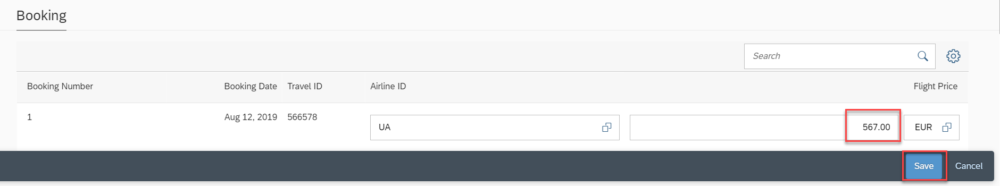


#### Solution 
Solution for this exercise can be found [here](/docs/Managed%20Implementation/DevelopingValidationsM/Solutions/Exercise-7)

**Next Step**

[Developing Authorization Control](/docs/Managed%20Implementation/DevelopingAuthorizationControlM/README.md)
