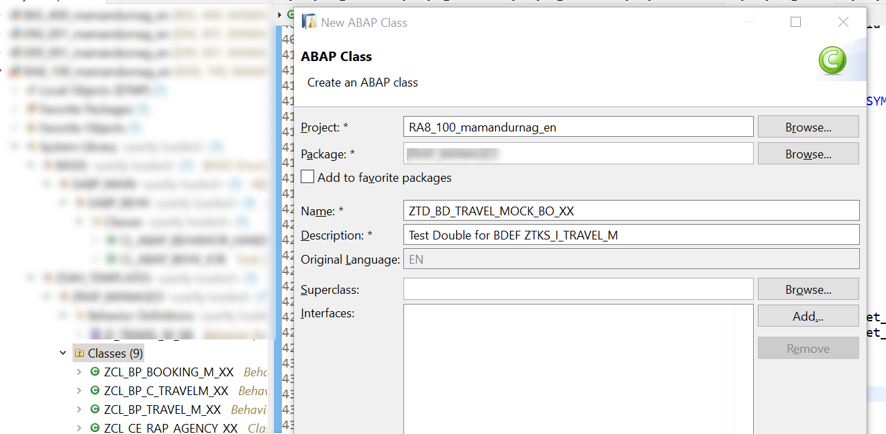
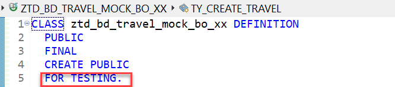
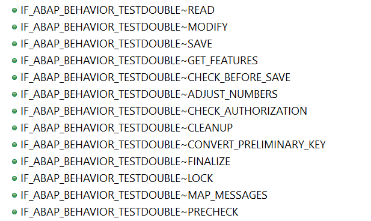

**Previous Step**

[Testing Behavior Implementation using EML by CDS/SQL Test Double Framework](/docs/Testability/CDS-SQL%20Test%20Double%20Framework/readme.md)

# Testing Behavior Implementation using EML by Behavior Test Double Framework
* [Introduction](#introduction)
* [Exercise 1 – Create action for foreign BO call](#exercise-1)
* [Exercise 2 – Create Behavior Test Double for foreign BO](#exercise-2)
* [Exercise 3 – Implement test method](#exercise-3)

<a id="introduction"></a>
# Introduction
Another aspect of testing a behavior implementation is to test the logic present in the methods of behavior handler class and behavior saver class of one business object. While doing so, other logic like determinations and validations should not get executed while executing the corresponding EML statements. What this means is that while testing the logic present in the behavior implementation of a BO node, you need to isolate its dependencies on the behavior implementations of the other dependent BO nodes (side-effects) by creating a test double for each of these behavior implementations associated with these side-effects.
You can do this by using a simple API which allows you to replace the behavior implementation with a test double when the EML for these dependent BOs get executed in the unit test context using this approach as explained below:
•	Implementing the interface IF_ABAP_BEHAVIOR_TESTDOUBLE, either manually or by using the ABAP TDF. You can implement the test double for your behavior dependencies as per your test goal. This interface contains methods for all the operations related to both “behavior handler” as well as “behavior saver”.
•	You can write the verification aspects (Asserts) after the test is executed within your behavior test double implementation.
•	On the other hand, if you wish to "spy" on all "modify" calls to the BO, you can implement some kind of logging in the MODIFY method and verify the log afterward.
•	A useful aspect you may need to note here is that all the interface methods are set to "default ignore", so implementation is optional. E.g. if you don't implement the LOCK method, it will simply do nothing.
•	Finally, for injecting the test double for behavior implementation use this API:

```
CL_ABAP_BEHV_TEST_ENVIRONMENT=>set_test_double( behv_test_double_impl ).
```

This API will help in injecting your test double for the behavior implementation so that whenever an EML statement is executed during test execution, the corresponding methods in these handler and saver test double gets invoked instead of the actual behavior implementation.

Sample code snippet:

```
class lcl_td_1 definition. … interfaces IF_ABAP_BEHAVIOR_TESTDOUBLE.
…
CL_ABAP_BEHV_TEST_ENVIRONMENT=>set_test_double( new lcl_td_1( root = 'ROOTNAME1' ) ).
CL_ABAP_BEHV_TEST_ENVIRONMENT=>set_test_double( new lcl_td_2( root = 'ROOTNAME2' ) ).
```

<a id="exercise-1"></a>
# Exercise 1 – Create action for foreign BO call
We will isolate side-effects using an example where a foreign BO is called in own BO. A test double is created for foreign BO where the foreign BO’s side-effects can be isolated.

1.	Introduce a new action in BDEF


2.	In the BIMP, define the action

```
    METHODS test_mock_bo FOR MODIFY IMPORTING keys FOR ACTION travel~test_mock_bo.
```    
    
3.	Implement the action. Simply create travel entry using a foreign BO

```
  METHOD test_mock_bo.
     "To be used for RAP testability demo
    MODIFY ENTITIES OF ZTKS_I_TRAVEL_M "foreign BO
      ENTITY travel
      CREATE SET FIELDS WITH VALUE #( ( %cid = 'CID_TRV'
                                      AgencyID    = '70003'
                                      CustomerID  = '14'
                                      BeginDate   = cl_abap_context_info=>get_system_date( )
                                      EndDate     = cl_abap_context_info=>get_system_date( ) + 10
                                      Description = 'For Mock BO unit test'
                                      TotalPrice  = 40
                                      CurrencyCode = 'USD' ) ).
  ENDMETHOD.
```

<a id="exercise-2"></a>
# Exercise 2 – Create Behavior Test Double for foreign BO
1.	Create an ABAP class


2.	Append FOR TESTING construct to make the class a test class


3.	Inherit interface IF_ABAP_BEHAVIOR_TESTDOUBLE

```
CLASS ztd_bd_travel_mock_bo_xx DEFINITION
  PUBLIC
  FINAL
  CREATE PUBLIC
  FOR TESTING.

  PUBLIC SECTION.
    INTERFACES if_abap_behavior_testdouble PARTIALLY IMPLEMENTED.
ENDCLASS.
```

Interface has the below methods that can be doubled


4.	Define methods for CONSTRUCTOR and a static method CREATE which will create the instance of the test double

```
CLASS ztd_bd_travel_mock_bo_xx DEFINITION
  PUBLIC
  FINAL
  CREATE PUBLIC
  FOR TESTING.

  PUBLIC SECTION.
    INTERFACES if_abap_behavior_testdouble PARTIALLY IMPLEMENTED.

    CLASS-METHODS: create RETURNING VALUE(rr_double) TYPE REF TO ztd_bd_travel_mock_bo_xx.

    METHODS: constructor.
  PROTECTED SECTION.
  PRIVATE SECTION.
ENDCLASS.
```

5.	Implement the methods CONSTRUCTOR, CREATE 

```
CLASS ztd_bd_travel_mock_bo_xx IMPLEMENTATION.

  METHOD constructor.
    if_abap_behavior_testdouble~root_name = 'ZTKS_I_TRAVEL_M'.
  ENDMETHOD.


  METHOD create.
    rr_double = NEW #(  ).
  ENDMETHOD.
ENDCLASS.
```

6.	Implement if_abap_behavior_testdouble~modify method. MODIFY is used for all CRUD operations on the BO. A sample Travel ID and Travel UUID is set in the test double method. Declare necessary declarations in the definition

```
    DATA: mt_result      TYPE TABLE FOR READ RESULT ztks_i_travel_m.

  PROTECTED SECTION.
    TYPES: ty_failed        TYPE RESPONSE FOR FAILED ztks_i_travel_m,
           ty_mapped        TYPE RESPONSE FOR MAPPED ztks_i_travel_m,
           ty_reported      TYPE RESPONSE FOR REPORTED ztks_i_travel_m,
           ty_create_travel TYPE TABLE FOR CREATE ztks_i_travel_m.
  PRIVATE SECTION.

METHOD if_abap_behavior_testdouble~modify.

    FIELD-SYMBOLS:
      <lt_instances> TYPE ty_create_travel,
      <lt_results>   TYPE ty_create_travel,
      <ls_instance>  LIKE LINE OF <lt_instances>.

    DATA: lv_travel_id    TYPE /dmo/travel_id.

    FIELD-SYMBOLS <failed> TYPE ty_failed.
    ASSIGN failed TO <failed>.

    FIELD-SYMBOLS <mapped> TYPE ty_mapped.
    ASSIGN mapped TO <mapped>.

    FIELD-SYMBOLS <reported> TYPE ty_reported.
    ASSIGN reported TO <reported>.

    LOOP AT changes REFERENCE INTO DATA(lr_change).
      CASE lr_change->entity_name.
        WHEN 'ZTKS_I_TRAVEL_M'.

          CASE lr_change->op.
            WHEN if_abap_behv=>op-m-create.    "Create
              ASSIGN lr_change->instances->* TO <lt_instances>.
              ASSIGN lr_change->results->* TO <lt_results>.

              READ TABLE <lt_instances> ASSIGNING <ls_instance> INDEX 1.

              <ls_instance>-TravelID = '00000001'.
              <ls_instance>-TravelUuid = '12345'.
              <lt_results> = CORRESPONDING #( <lt_instances> ).
              APPEND LINES OF CORRESPONDING ty_mapped-travel( <lt_instances> ) TO <mapped>-travel.
              mt_result = CORRESPONDING #( <lt_results> ).

            WHEN if_abap_behv=>op-m-update.    "Update
            WHEN if_abap_behv=>op-m-delete.    "Delete
            WHEN if_abap_behv=>op-m-create_ba. "Create By Association
            WHEN if_abap_behv=>op-m-action.    "Action
          ENDCASE.
      ENDCASE.
    ENDLOOP.
  ENDMETHOD.
```  
  
7.	Implement if_abap_behavior_testdouble~read method which will return the travel instance created. 

```
  METHOD if_abap_behavior_testdouble~read.
    FIELD-SYMBOLS:
      <lt_instances> TYPE STANDARD TABLE,
      <lt_results>   TYPE STANDARD TABLE.

    READ TABLE retrievals REFERENCE INTO DATA(lr_retrievals) INDEX 1.
    ASSIGN lr_retrievals->instances->* TO <lt_instances>.
    ASSIGN lr_retrievals->results->* TO <lt_results>.

    CASE lr_retrievals->op.
      WHEN if_abap_behv=>op-r-read. "Read
        INSERT LINES OF mt_result INTO TABLE <lt_results>.
    ENDCASE.
  ENDMETHOD.
```

<a id="exercise-3"></a>
# Exercise 3 – Implement test method

1.	Create a test method MOCK_FOREIGN_BO

```
    METHODS:       mock_foreign_bo FOR TESTING.
```    
    
2.	Implement test method MOCK_FOREIGN_BO. Set the test double instance in the behavior test environment. The test double is called instead of the actual BO. This way, the side-effects can be isolated from execution

```
  METHOD mock_foreign_bo.
    DATA(lr_double) = NEW ztd_bd_travel_mock_bo_xx(  ).
    cl_abap_behv_test_environment=>set_test_double( lr_double ).

    MODIFY ENTITY zi_travel_m_xx
          EXECUTE test_mock_bo
       FROM VALUE #( ( travel_id = '1' ) )
           MAPPED DATA(mapped)
           FAILED DATA(failed)
           REPORTED DATA(reported).

    READ ENTITIES OF ztks_i_travel_m
      ENTITY travel
        ALL FIELDS WITH VALUE #( ( TravelUuid = '12345') )
      RESULT   DATA(lt_travel)
      FAILED   DATA(failed_read)
      REPORTED DATA(reported_read).

    cl_abap_unit_assert=>assert_not_initial( lt_travel ).
    cl_abap_unit_assert=>assert_initial( failed_read ).

    cl_abap_behv_test_environment=>unset_test_double( 'ZTKS_I_TRAVEL_M' ).
  ENDMETHOD.
```

[End of module. Return to Home](https://github.wdf.sap.corp/DevelopmentLearning/restful-abap/wiki "ABAP RESTful Programming Model")
