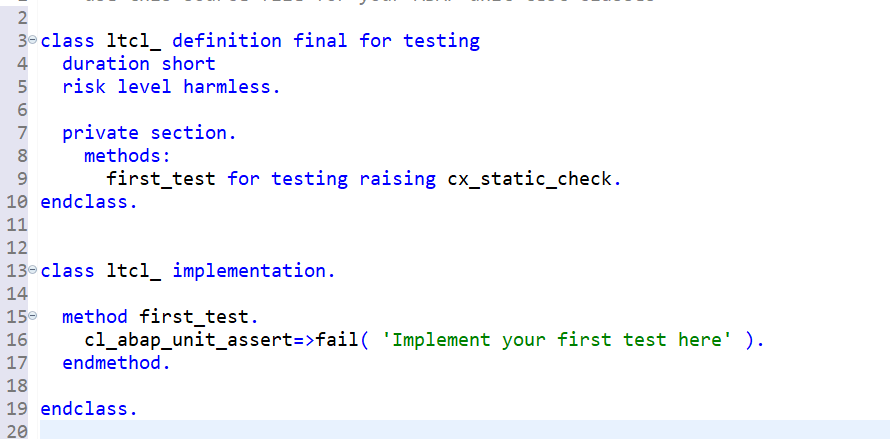

**Previous Step**

[Managed Implementation](/docs/Managed%20Implementation/DataModelManaged/readme.md)

# Testing Behavior Implementation using EML by CDS/SQL Test Double Framework
* [Introduction](#introduction)
* [Exercise 1 - Creating a Test Class](#exercise-1)
* [Exercise 2 - Isolate Database Dependencies](#exercise-2)
* [Exercise 3 - Test Actions](#exercise-3)
* [Exercise 4 – Test Instance Feature Control](#exercise-4)
* [Exercise 5 – Test Draft Handling](#exercise-5)
* [Exercise 6 – Test Draft Determine Actions](#exercise-6)
* [Exercise 7 – Test Determine Actions](#exercise-7)
* [Exercise 8 – Check Coverage](#exercise-8)

<a id="introduction"></a>
# Introduction
One aspect of testing the BO functionality is that the EML present inside the behavior implementation should get executed along with all the side-effects in determinations & validations (other EML statements) but the database calls should not happen from the 'multiple' CDS entities associated with the BO nodes.
You can use test doubles to isolate your database artifacts while testing your BO using EML. For an unmanaged scenario, this works as long as your unmanaged BO implementation logic does not contain any UPDATE task which runs in a different ABAP session. Test doubles for database artifacts created using CDS/ABAP-SQL test double framework do not work in a different ABAP session.
You can either use ABAP SQL test double framework or CDS test double framework to create test doubles for your database dependencies. 

<a id="exercise-1"></a>
# Exercise 1 - Creating a Test Class
1.  In your ADT, right click on Classes and create a new ABAP Class

2.	Include FOR TESTING construct to the class definition which indicates that the ABAP class is now a test class

3.	Go to Test Classes tab, type test and Ctrl+Space. Choose testClass, push Enter and code is generated


4.	Delete the sampe first_test method from definition and implementation
5.	Rename local test class as ltcl_travel
6.	Create setup and teardown methods

7.	Indicate that this test class covers the behavior implementation and/or behavior definition
To indicate to the ABAP system which entities are covered by a test class or test method, ABAP test relations were invented. The usage is simple, just add an ABAP doc comment in the definition part of the class one line above the class or the methods statement. This is useful for entities which have no own test include like Core Data Services or for integration tests covering several entities.


<a id="exercise-2"></a>
# Exercise 2 - Isolate Database Dependencies
Create a test double for CDS root entity using the CDS Test Double Framework and create a test double for draft tables and other database tables manually accessed as part of unmanaged/additional save implementations.
1.	Declare the test double instances in the PRIVATE SECTION of the local class

```
  PRIVATE SECTION.
    CLASS-DATA: cds_environment  TYPE REF TO if_cds_test_environment,
                osql_environment TYPE REF TO if_osql_test_environment.
```

2.	In the CLASS_SETUP method, create the double instances

```
  METHOD class_setup.
    cds_environment = cl_cds_test_environment=>create( i_for_entity = 'ZI_TRAVEL_M_XX'
                                                       test_associations = 'X').  
    osql_environment = cl_osql_test_environment=>create( i_dependency_list = 
                                                          VALUE #( ( 'ZDTRAVEL_XX' )
                                                                   ( '/DMO/LOG_TRAVEL')
                                                                   ( '/DMO/BOOKING' )
                                                                   ( 'ZDBOOK_XX' ) ) ).
                                                       
  ENDMETHOD.
```

3.	Destroy the instances in the CLASS_TEARDOWN

```
  METHOD class_teardown.
    cds_environment->destroy(  ).
    osql_environment->destroy(  ).
  ENDMETHOD.
  ```
  
4.	Implement TEARDOWN. The double instances are cleared and ROLLBACK ENTITIES is done. ROLLBACK ENTITIES is done to ensure that transactional buffer is reset every time a new test method is called.

  ```
  METHOD teardown.
    ROLLBACK ENTITIES.
    cds_environment->clear_doubles(  ).
    osql_environment->clear_doubles(  ).
  ENDMETHOD.
  ```

5.	Activate the test class

<a id="exercise-3"></a>
# Exercise 3 - Test Actions
1.	Create test methods for acceptTravel and rejectTravel actions in the PRIVATE SECTION of class ltcl_travel DEFINITION. Create empty implementation methods for the same.

```
CLASS ltcl_travel DEFINITION FINAL FOR TESTING
  DURATION SHORT
  RISK LEVEL HARMLESS.

  PRIVATE SECTION.
…….. 
    METHODS:
      acceptTravel FOR TESTING,
      rejectTravel FOR TESTING.
```      

2.	Create test data on which actions needs to be executed. For this, a static method PREPARE_TEST_DATA will be created so that this can be re-used in every test method.
Declare the method definition and declare a global variable travel_id

```
CLASS ltcl_travel DEFINITION FINAL FOR TESTING
  DURATION SHORT
  RISK LEVEL HARMLESS.

  PRIVATE SECTION.
    CLASS-DATA: cds_environment  TYPE REF TO if_cds_test_environment,
                osql_environment TYPE REF TO if_osql_test_environment,
                travel_id        TYPE /dmo/travel_id.

    CLASS-METHODS:
      class_setup,
      class_teardown,
      prepare_test_data.
```      
      
3.	Implement the PREPARE_TEST_DATA method. Here, a travel entry is created with valid values and 2 booking entries are created under this travel. Populate the travel ID created in the global variable.

```
METHOD prepare_test_data.
    "Create test travel and associated booking entry
    MODIFY ENTITIES OF zi_travel_m_xx
      ENTITY travel
      CREATE SET FIELDS WITH VALUE #( ( %cid        = 'CID_TRV'
                                      agency_id     = '70003'
                                      customer_id   = '14'
                                      begin_date    = cl_abap_context_info=>get_system_date( )
                                      end_date      = cl_abap_context_info=>get_system_date( ) + 10
                                      description   = 'Created by unit test'
                                      total_price   = 40
                                      currency_code = 'USD' ) )
      CREATE BY \_Booking SET FIELDS WITH VALUE #( ( %cid_ref = 'CID_TRV'
                                                     %is_draft = draft
                                                     %target = VALUE #( ( %cid = 'CID_BK_1'
                                                                          carrier_id = 'UA'
                                                                          booking_date = cl_abap_context_info=>get_system_date( )
                                                                          customer_id = '000594'
                                                                          connection_id = '1537'
                                                                          flight_price = 20
                                                                          currency_code = 'USD' ) ) )
                                                   ( %cid_ref = 'CID_TRV'
                                                     %target = VALUE #( ( %cid = 'CID_BK_2'
                                                                          carrier_id = 'UA'
                                                                          booking_date = cl_abap_context_info=>get_system_date( )
                                                                          customer_id = '000594'
                                                                          connection_id = '1537'
                                                                          flight_price = 20
                                                                          currency_code = 'INR' ) ) ) )

      MAPPED DATA(mapped)
      REPORTED DATA(reported_create)
      FAILED DATA(failed_create).

COMMIT ENTITIES
RESPONSE OF zi_travel_m_xx
FAILED DATA(failed_commit)      
REPORTED DATA(reported_commit).

travel_id = mapped-travel[ 1 ]-%tky-travel_id.

  ENDMETHOD.
```  
  
4.	Implement the acceptTravel test method by executing action acceptTravel. 

```
  METHOD acceptTravel.

    prepare_test_data( ).

    MODIFY ENTITY zi_travel_m_xx
          EXECUTE acceptTravel
       FROM VALUE #( ( travel_id = travel_id ) )
           RESULT DATA(result).

    cl_abap_unit_assert=>assert_equals( act = result[ 1 ]-%param-status
                                        exp = 'A' ).
  ENDMETHOD.
```  
  
5.	Implement the rejectTravel test method by executing action rejectTravel

```
METHOD rejectTravel.

    prepare_test_data( ).

    MODIFY ENTITY zi_travel_m_xx EXECUTE rejectTravel FROM VALUE #( ( travel_id = travel_id ) )
      RESULT DATA(result).

    cl_abap_unit_assert=>assert_equals( act = result[ 1 ]-%param-status
                                        exp = 'X' ).
ENDMETHOD.
```

6.	Activate test class. Run the class as a ABAP unit test class


The results of the test method execution can be seen


When you debug the flow, you will notice that only the database dependencies were isolated here. The side-effects, that is, validations, determinations, early numbering are called as-is.

<a id="exercise-4"></a>
# Exercise 4 - Test Instance Feature Control
Instance Feature Control is enabled in BDEF for acceptTravel and rejectTravel actions. Once travel status is accepted, acceptTravel button is disabled and rejectTravel button is enabled. Once travel status is rejected, rejectTravel button is disabled and acceptTravel button is enabled.

1.	In acceptTravel test method, append below lines to test its instance features

```
 DATA: request_ifc TYPE STRUCTURE FOR PERMISSIONS REQUEST zi_travel_m_xx.
    request_ifc-%action-acceptTravel = if_abap_behv=>mk-on.

    GET PERMISSIONS ONLY INSTANCE FEATURES ENTITY zi_travel_m_xx
      FROM  VALUE #( ( travel_id = travel_id
                       %is_draft  = if_abap_behv=>mk-off ) )
      REQUEST request_ifc
    RESULT DATA(result_ifc)
    FAILED DATA(failed_ifc)
    REPORTED DATA(reported_ifc).

    cl_abap_unit_assert=>assert_equals( act = result_ifc-instances[ 1 ]-%action-acceptTravel
                                        exp = if_abap_behv=>fc-o-disabled ).
    cl_abap_unit_assert=>assert_initial( failed_ifc ).
    cl_abap_unit_assert=>assert_initial( reported_ifc ).
```    
    
2.	Activate class and run as ABAP unit test class. You will see that the test method executed successfully
3.	Similarly, append below lines to rejectTravel test method to test its instance features

```
 DATA: request_ifc TYPE STRUCTURE FOR PERMISSIONS REQUEST zi_travel_m_xx.

    request_ifc-%action-rejectTravel = if_abap_behv=>mk-on.

    GET PERMISSIONS ONLY INSTANCE FEATURES ENTITY zi_travel_m_xx
      FROM  VALUE #( ( travel_id = travel_id
                       %is_draft  = if_abap_behv=>mk-off ) )
      REQUEST request_ifc
    RESULT DATA(result_ifc)
    FAILED DATA(failed_ifc)
    REPORTED DATA(reported_ifc).

    cl_abap_unit_assert=>assert_equals( act = result_ifc-instances[ 1 ]-%action-rejectTravel
                                        exp = if_abap_behv=>fc-o-disabled ).
    cl_abap_unit_assert=>assert_initial( failed_ifc ).
    cl_abap_unit_assert=>assert_initial( reported_ifc ).
```    
    
4.	Activate class and run as ABAP unit test class. You will see that the test method executed successfully

<a id="exercise-5"></a>
# Exercise 5 - Test Draft Handling
You can write unit tests to check the draft capabilities of your BO.

1.	Declare an OPTIONAL parameter to PREPARE_TEST_DATA for draft and create a global variable to store draft travel ID

```  
    CLASS-DATA: travel_id_draft  TYPE /dmo/travel_id.
    CLASS-METHODS:
      prepare_test_data IMPORTING draft TYPE if_abap_behv=>t_xflag OPTIONAL.
```        
      
2.	Enhance PREPARE_TEST_DATA to create test data based on draft handling

```  
  "Create test travel and associated booking entry
    MODIFY ENTITIES OF zi_travel_m_xx
      ENTITY travel
      CREATE SET FIELDS WITH VALUE #( ( %cid        = 'CID_TRV'
                                      %is_draft     = draft
                                      agency_id     = '70003'
                                      customer_id   = '14'
                                      begin_date    = cl_abap_context_info=>get_system_date( )
                                      end_date      = cl_abap_context_info=>get_system_date( ) + 10
                                      description   = 'Created by unit test'
                                      total_price   = 40
                                      currency_code = 'USD' ) )
      CREATE BY \_Booking SET FIELDS WITH VALUE #( ( %cid_ref = 'CID_TRV'
                                                     %is_draft = draft
                                                     %target = VALUE #( ( %cid = 'CID_BK_1'
                                                                          %is_draft   = draft
                                                                          carrier_id = 'UA'
                                                                          booking_date = cl_abap_context_info=>get_system_date( )
                                                                          customer_id = '000594'
                                                                          connection_id = '1537'
                                                                          flight_price = 20
                                                                          currency_code = 'USD' ) ) )
                                                   ( %cid_ref = 'CID_TRV'
                                                     %is_draft = draft
                                                     %target = VALUE #( ( %cid = 'CID_BK_2'
                                                                          %is_draft = draft
                                                                          carrier_id = 'UA'
                                                                          booking_date = cl_abap_context_info=>get_system_date( )
                                                                          customer_id = '000594'
                                                                          connection_id = '1537'
                                                                          flight_price = 20
                                                                          currency_code = 'INR' ) ) ) )

      MAPPED DATA(mapped)
      REPORTED DATA(reported_create)
      FAILED DATA(failed_create).

    IF draft = if_abap_behv=>mk-off.
      COMMIT ENTITIES
      RESPONSE OF zi_travel_m_xx
      FAILED DATA(failed_commit)
      REPORTED DATA(reported_commit).

      travel_id = mapped-travel[ 1 ]-%tky-travel_id.
    ELSE.
      travel_id_draft = mapped-travel[ 1 ]-%tky-travel_id.
    ENDIF.
  ENDMETHOD.
```    
  
3.	Create a test method CREATE_DRAFT

```  
METHODS: create_draft FOR TESTING.
```  

4.	Implement the CREATE_DRAFT method. Here, the PREPARE_TEST_DATA method is called with draft enabled. This will create a test travel entry in the draft state. Once COMMIT ENTITIES is called, the entry from draft moves to draft tables. During this transition, all validations and determinations at the time of SAVE is executed

```  
METHOD create_draft.
    prepare_test_data( draft = if_abap_behv=>mk-on ).

    "Entry present in draft instance
    READ ENTITIES OF zi_travel_m_xx
      ENTITY travel
        ALL FIELDS WITH VALUE #( ( %key = travel_id_draft
                                   %is_draft = if_abap_behv=>mk-on ) )
      RESULT   DATA(lt_travel)
      FAILED   DATA(failed_read)
      REPORTED DATA(reported_read).

    cl_abap_unit_assert=>assert_not_initial( lt_travel ).

    "Entry not present in non-draft transactional buffer
    READ ENTITIES OF zi_travel_m_xx
      ENTITY travel
        ALL FIELDS WITH VALUE #( ( %key = travel_id_draft
                                   %is_draft = if_abap_behv=>mk-off ) )
      RESULT   lt_travel
      FAILED   failed_read
      REPORTED reported_read.

    cl_abap_unit_assert=>assert_initial( lt_travel ).

    SELECT * FROM zdbook_xx INTO TABLE @DATA(lt_bookings) WHERE travel_id = @travel_id_draft.

    cl_abap_unit_assert=>assert_equals( act = lines( lt_bookings )
                                        exp = 0 ).

    "Commit entities
    COMMIT ENTITIES.

    SELECT * FROM zdbook_xx INTO TABLE lt_bookings WHERE travel_id = travel_id_draft.

    cl_abap_unit_assert=>assert_equals( act = lines( lt_bookings )
                                        exp = 2 ).
  ENDMETHOD.
```    

5.	Activate the class and run as ABAP unit test class. The test methods execute successfully.

<a id="exercise-6"></a>
# Exercise 6 - Test Draft Determine Actions
You can also test draft determine actions that have been defined in the BDEF.


The validations defined above are called during the draft action Prepare.

1.	Create a test method DRAFT_ACTIONS

```   
METHODS: draft_actions FOR TESTING.
```   

2.	Implement this method as below. In this method, we will update the END_DATE to SPACE which is invalid end date. This is done to check if validateDates validations is called during draft action Prepare.

```   
METHOD draft_actions.
prepare_test_data( draft = if_abap_behv=>mk-on ).
    MODIFY ENTITIES OF zi_travel_m_xx
     ENTITY travel
     UPDATE SET FIELDS WITH VALUE #( ( %is_draft = if_abap_behv=>mk-on
                                       travel_id = travel_id
                                       end_date = '') ) "invalid end date to check validations called during Prepare
     FAILED failed
     REPORTED reported.


    MODIFY ENTITIES OF zi_travel_m_xx
          ENTITY travel
           EXECUTE Prepare
             FROM VALUE #( ( %key-travel_id = travel_id ) )
              MAPPED   mapped
              FAILED   failed
              REPORTED reported.

    cl_abap_unit_assert=>assert_not_initial( failed ).

  ENDMETHOD.
```     
  
3.	Activate the class and run as ABAP unit test class. The test methods execute successfully.

<a id="exercise-7"></a>
# Exercise 7 - Test Determine Actions
You can test determine actions that are defined in the BDEF.


1.	Create a test method 

``` 
METHODS: determine_action FOR TESTING.
``` 

2.	Implement the method. In the definition, action check_customer is configured as a DETERMINE ACTION. The validation validateCustomer is called whenever action check_customer is executed. In order to test this, we will not COMMIT ENTITIES once a test travel entry is created as COMMIT also calls this validation. We will execute this validation by executing the action check_customer using EML statement.

``` 
  METHOD determine_action.
    MODIFY ENTITIES OF zi_travel_m_xx
      ENTITY travel
      CREATE SET FIELDS WITH VALUE #( ( %cid        = 'CID_TRV'
                                      %is_draft     = if_abap_behv=>mk-on
                                      agency_id     = '70003'
                                      customer_id   = '000594'
                                      begin_date    = cl_abap_context_info=>get_system_date( )
                                      end_date      = cl_abap_context_info=>get_system_date( ) + 10
                                      description   = 'Created by unit test'
                                      total_price   = 40
                                      currency_code = 'USD' ) )
    MAPPED DATA(mapped)
    FAILED DATA(failed)
    REPORTED DATA(reported).

    "No commit entities to be called...explicit validation to happen on determine action check_customer

    MODIFY ENTITY zi_travel_m_xx
          EXECUTE check_customer
       FROM VALUE #( ( travel_id = travel_id ) )
           MAPPED DATA(mapped_execute)
           FAILED DATA(failed_execute)
           REPORTED DATA(reported_execute).

    cl_abap_unit_assert=>assert_not_initial( failed_execute ).
  ENDMETHOD.
```   
  
3.	Activate the class and run as ABAP unit test class. The test methods execute successfully.

<a id="exercise-8"></a>
# Exercise 8 - Check Coverage
You can check the coverage of unit tests written on the Behavior Implementation class using the option – Run as ABAP Unit Test With “Coverage” for your Behavior Implementation class


Open the window that displays the coverage


Coverage measurements are displayed. The below statistics are Statement Coverage.


You can check Branch Coverage and Procedure Coverage as below


**Next Steps**

[Testing Behavior Implementation using EML by Behavior Test Double Framework](/docs/Testability/Behavior%20Test%20Double%20Framework/readme.md)
