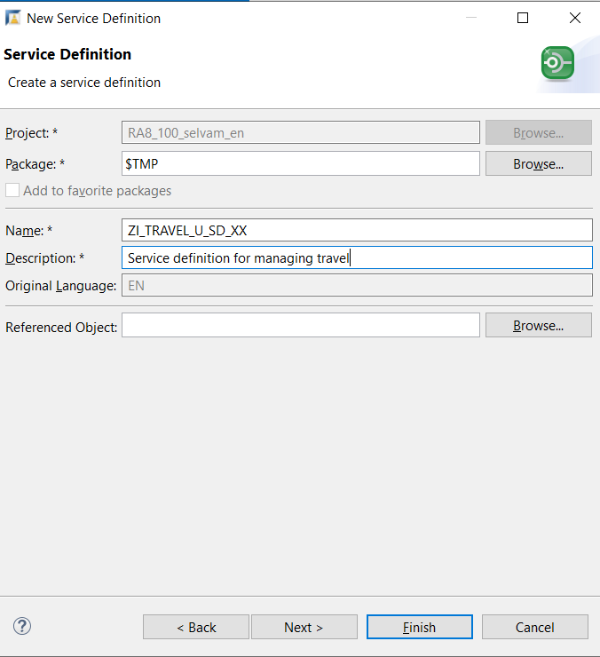
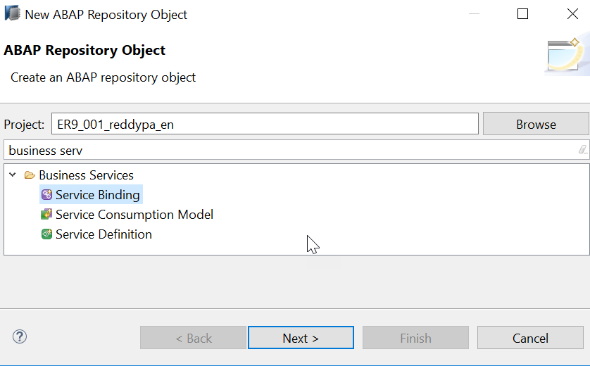
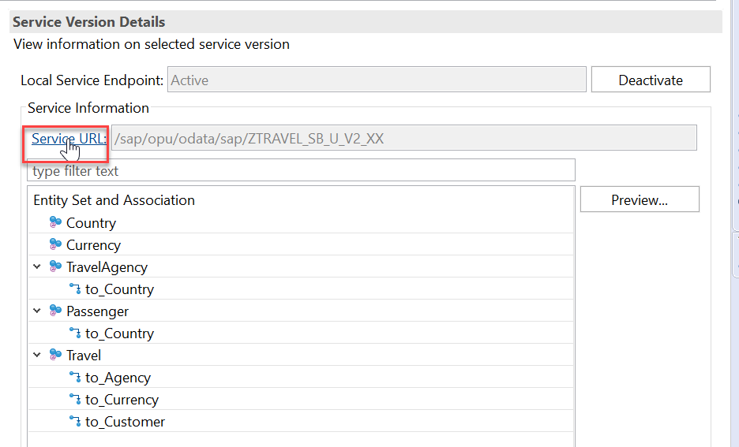
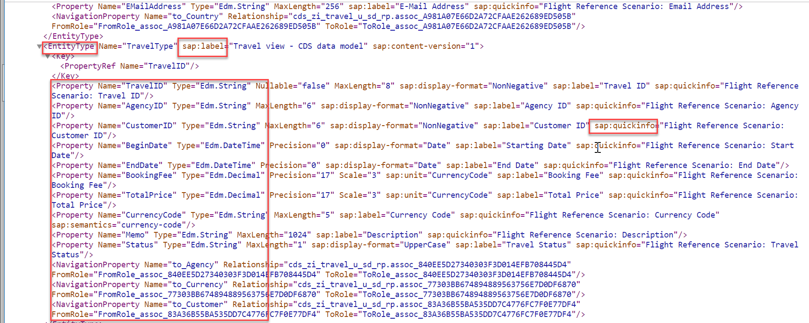
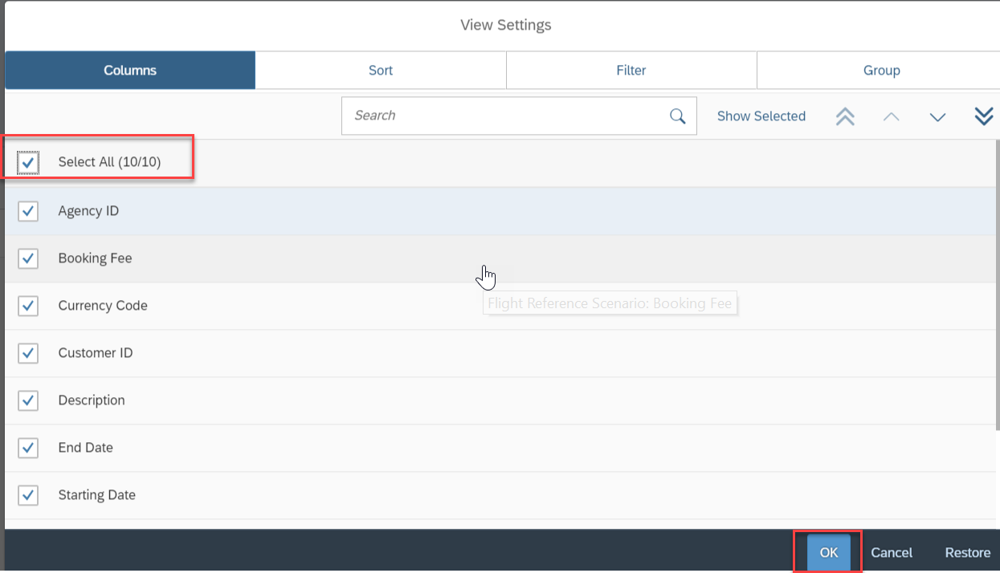
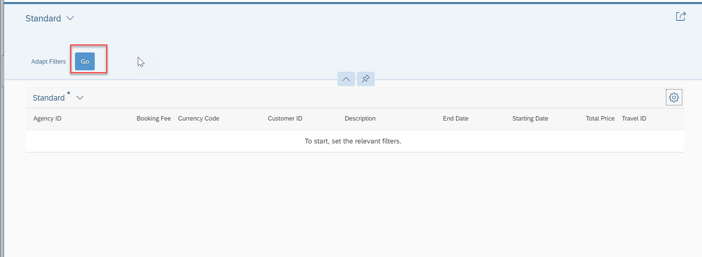

**Previous Step**

[Defining the Data Model with CDS](/docs/Unmanaged%20Implementation/DefiningDataModel/README.md)

# Creating an OData Service
* [Exercise 1 - Creating a Service Definition](#exercise-1)
* [Exercise 2 - Creating a Service Binding](#exercise-2)
* [Summary](#summary)

<a id="exercise-1"></a>
# Exercise 1 - Creating a Service Definition
The service definition is a projection of the models and related behavior that you want to expose. In a service definition, you define the OData service to determine which CDS entities are part of the service. This service is then bound to a protocol and to either a UI technology or an A2X service by a service binding artifact. A service definition can be integrated in various protocols without any reimplementation.
1.	Open the context menu and choose `New->Other ABAP Repository Object->Business Services->Service Definition` to launch the creation wizard.


Click on `Next`

2.	Give Service Definition Name **ZI_TRAVEL_U_SD_XX** (Replace XX with your initials) and Description as Below:


3.	In the service definition editor define the CDS entities which needs to be exposed as OData service as below:

```
expose zI_TRAVEL_U_xx as Travel;
expose zI_AGENCY_U_xx as TravelAgency;
expose zI_CUSTOMER_U_xx as Passenger;
expose I_Currency as Currency;
expose I_Country as Country;
```
service definition is used to assign the scope of the OData service. Travel, TravelAgency, Passenger, Currency, country CDS views are exposed in the service definition. Optionally, you can assign an alias for the each exposed CDS view

4.	Click the activation button or use the shortcut `Ctrl + F3` to activate the data definition.

#### Solution 
Solution for this exercise can be found [here](/docs/Unmanaged%20Implementation/CreatingODataService/Solutions/Exercise-1)

<a id="exercise-2"></a>
# Exercise 2 - Creating a Service Binding
A service binding implements the protocol that is used for the OData service. It uses a service definition that projects the data models and their related behaviors to the service.
1.	Open the context menu by right clicking in Project Explorer and choose `New->Other ABAP Repository Object->Business Services->Service Binding` to launch the creation wizard for a service binding.




2.	Give Name of Service Binding, Description, Select Binding Type as `ODATA V2 - UI` from dropdown and browse service definition `ZI_TRAVEL_U_SD_XX` created in [Exercise-1](#exercise-1) as below and click on Finish. 


3.	As soon as you have specified the binding for the service, it is ready for publishing. The service is then available for consumption. The binding type and category are already defined and cannot be changed once the service binding is created. To make the service ready for consumption, use the Activate (CTRL+F3) button of the eclipse toolbar and then click on the publish button (next to Local Service Endpoint).


4.	On the left side of the form editor, the service list with the service definition and version. The right side of the form editor shows the service URL and lists the entity sets that are exposed for the service.


5.	In the previous steps we defined an OData service and published it. It is now ready for to be consumed by an HTTP protocol. To verify the data that the OData service exposes, the service offers a metadata document in which all relevant service elements are listed. Click on the Service URL link to check the metadata document of the published OData service. The browser opens and displays the metadata of the service

To View metadata replace `?sap-client=100` in your URL with `$metadata` 





6.	The published OData service is ready to be consumed by an HTTP protocol. You can set up a Fiori application based on this service. The service binding artifact offers a tool which you can use to preview a simple list reporting Fiori application. Double click the entity in the service binding to check how the UI of a Fiori application looks like.


7.	Your internet browser opens a new tab and requests authorization for the system. Enter your user name and password for the relevant system. You now have access to the system and the application is displayed. Initially the table does not show any columns. You have to manually select the columns and click GO to display the data. We will be fixing it in subsequent steps via metadata annotations


8.	You need to select at least one element, otherwise you get an error message when retrieving the data or Click on select all check box and click OK



9.	Choose Go to display the data of the items you selected




<a id="summary"></a>
# Summary
In the Project Explorer, the new service definition `ZI_TRAVEL_U_SD_XX` (Replace XX with your initials) is added to the Business Services folder of the corresponding package node.

Service definition named ZI_TRAVEL_U_SD_XX (Replace XX with your initials) is defined and it exposes the CDS view `ZI_TRAVEL_U_XX` (Replace XX with your initials), `ZI_Agency_U_XX` (Replace XX with your initials) , `ZI_Customer_U_XX` (Replace XX with your initials), `I_Currency` and `I_Country`  to be included in the service.

The ABAP back end creates a service binding and stores it in the ABAP Repository.
In the Project Explorer, the new service binding `ZTRAVEL_SB_U_V2_XX` (Replace XX with your initials) is added to the Business Services folder of the corresponding package node. 

As soon as you have created the service binding for a service, the service is registered in your local system

The OData service `ZTRAVEL_SB_U_V2_XX` (Replace XX with your initials) is published locally, which means that it is activated in SAP Gateway. The service is bound to the protocol `OData V2` for the category `UI`. This means it can now be consumed by a SAPUI5 application.

The metadata document displays the relevant information that the OData service provides for an OData client in a CSDL (Common Schema Definition Language).

The **Fiori Elements App** preview opens in your browser. You see the connection data that you implemented in the CDS view. The standard filter and sorting options are available in the preview.

**Next Steps**

[Developing Read-Only List Reporting Apps](/docs/Unmanaged%20Implementation/DevelopingReadOnlyListReport/README.md)


